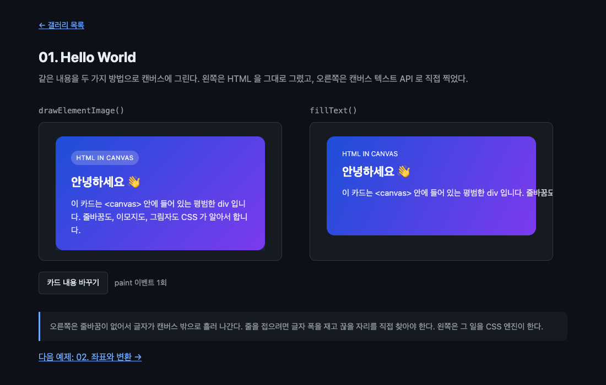

# 01. Hello World

HTML 카드 하나를 캔버스에 그린다. 같은 내용을 `fillText()` 로도 그려 나란히 놓는다.



## 무엇을 배우나

- `canvas.layoutSubtree` 를 켜야 canvas 자식이 레이아웃 대상이 된다
- `ctx.drawElementImage(element, dx, dy)` 로 자식 엘리먼트를 캔버스에 그린다
- 그리기는 `paint` 이벤트 안에서 한다. 그전에 부르면 예외가 난다
- `canvas.requestPaint()` 로 첫 프레임을 요청한다
- 자식 내용이 바뀌면 `paint` 가 알아서 다시 온다

## 실행 방법

```bash
mise run serve    # 터미널 1
mise run chrome   # 터미널 2
```

Chrome 이 열리면 `01-hello-world/` 로 들어간다. 플래그가 꺼져 있으면 노란 배너가 뜬다. [브라우저 셋업](../../docs/browser-setup.md)을 보자.

## 핵심 코드

### 1. 그릴 대상은 canvas 의 직계 자식이어야 한다

```html
<canvas id="stage" width="440" height="250">
  <div id="card">
    <p class="badge">HTML in Canvas</p>
    <h2 id="card-title">안녕하세요 👋</h2>
    <p id="card-body">이 카드는 &lt;canvas&gt; 안에 들어 있는 평범한 div 입니다.</p>
  </div>
</canvas>
```

`<canvas>` 안에 쓴 내용은 원래 fallback content 다. 캔버스를 지원하지 않는 브라우저에 보여 줄 대체 콘텐츠 자리이고, 평소에는 화면에 나오지 않는다. 이 API 는 바로 그 자리를 그리기 대상으로 쓴다. 덕분에 접근성 트리가 공짜로 따라온다. 스크린리더는 원래부터 이 fallback content 를 읽기 때문이다.

`#card` 안의 `<h2>` 나 `<p>` 는 손자다. 손자는 `drawElementImage()` 에 직접 넘길 수 없다. 넘길 수 있는 것은 `#card` 처럼 canvas 바로 아래에 있는 엘리먼트뿐이다.

### 2. 새로 배우는 줄은 세 개다

```js
// 이걸 켜야 canvas 자식이 레이아웃 대상이 된다. 끄면 측정도 그리기도 되지 않는다.
stage.layoutSubtree = true;

// 첫 스냅샷이 찍히기 전에 그리면 예외가 난다. 그래서 그리기는 paint 안에서만 한다.
stage.addEventListener(
  'paint',
  guardPaint(() => {
    ctx.reset();
    ctx.drawElementImage(card, 30, 25);

    paintCount += 1;
    status.textContent = `paint 이벤트 ${paintCount}회`;
  }),
);

// 첫 프레임을 요청한다. 이후로는 자식이 바뀔 때마다 paint 가 알아서 온다.
stage.requestPaint();
```

`guardPaint()` 는 저장소가 함께 쓰는 작은 도우미다. 캔버스가 화면에 아예 렌더링되지 않는 상황에서 나는 예외를 넘겨 준다. 지금은 없다고 생각하고 읽어도 된다. 무슨 예외인지는 아래 "막히는 지점" 에 적어 두었다.

`layoutSubtree` 를 빠뜨리면 아무 일도 일어나지 않는다. 에러도 나지 않는다. 캔버스가 그냥 비어 있다. 이 API 로 처음 뭔가 만들 때 가장 흔하게 밟는 지점이다.

`requestPaint()` 를 부르지 않으면 첫 그림이 나오지 않는다. 이벤트 리스너만 등록해 두고 기다리면 아무것도 오지 않는다.

### 3. 왜 paint 안에서 그려야 하나

`paint` 이벤트 밖에서 `drawElementImage()` 를 부르면 이렇게 된다.

```text
InvalidStateError: Failed to execute 'drawElementImage' on 'CanvasRenderingContext2D'
```

브라우저는 자식 엘리먼트의 렌더링 결과를 스냅샷으로 들고 있다가 그려 준다. 스냅샷이 아직 없으면 그릴 것이 없다. `paint` 이벤트는 "스냅샷이 준비됐다" 는 신호다.

### 4. 내용이 바뀌면 알아서 다시 온다

```js
cardTitle.textContent = sample.title;
cardBody.textContent = sample.body;
// 여기서 requestPaint() 를 부르지 않아도 paint 가 온다
```

버튼을 누르면 카드의 글자만 바꾼다. 다시 그리라고 시키지 않았는데도 캔버스가 갱신된다. 화면 아래 `paint 이벤트 N회` 카운터가 올라가는 것으로 확인할 수 있다. 텍스트뿐 아니라 CSS 스타일을 바꿔도 마찬가지다.

Chrome 151 에서 확인한 결과는 이렇다.

| 한 일                         | `paint` 가 오나           | `changedElements` |
| ----------------------------- | ------------------------- | ----------------- |
| `requestPaint()` 호출         | 온다                      | 바뀐 자식         |
| `textContent` 변경            | 온다 (직접 부르지 않아도) | 바뀐 자식         |
| CSS 스타일 변경               | 온다                      | 바뀐 자식         |
| 바뀐 것 없이 `requestPaint()` | 온다                      | 빈 배열           |

`changedElements` 를 활용하는 방법은 [04. paint 이벤트](../04-paint-event/)에서 다룬다.

### 5. 오른쪽 캔버스가 하는 일

비교용으로 같은 카드를 `fillText()` 로 그렸다. 배경 그라디언트와 둥근 모서리는 `roundRect()` 로 직접 그리고, 글자는 세 번 나눠 찍는다.

```js
ctx.fillStyle = 'rgb(248 250 252 / 88%)';
ctx.font = '15px system-ui, sans-serif';
ctx.fillText(sample.body, 58, 133);
```

`fillText()` 는 줄을 접지 않는다. 문장이 길면 캔버스 밖으로 나가 잘린다. 줄을 접으려면 `measureText()` 로 글자 폭을 재고, 어디서 끊을지 정하고, 줄 간격을 계산해 여러 번 `fillText()` 를 불러야 한다. 한국어는 단어 사이 공백이 드물어서 끊을 자리를 찾는 일이 특히 성가시다. 아랍어가 섞이면 양방향 처리까지 직접 해야 한다.

왼쪽은 그 일을 전부 CSS 엔진이 한다. 그게 이 API 의 요점이다.

## 직접 해볼 것

- `stage.layoutSubtree = true` 줄을 지워 보자. 에러 없이 캔버스만 비는 것을 확인한다
- `stage.requestPaint()` 를 지워 보자. 첫 그림이 나오지 않는다
- `paint` 리스너 밖에서 `ctx.drawElementImage(card, 0, 0)` 을 불러 보자. 콘솔에서 `InvalidStateError` 를 확인한다
- `#card` 대신 `#card-title` 을 그려 보자. 손자는 그릴 수 없다는 것을 확인한다
- `#card` 의 CSS 를 바꿔 보자. `border-radius`, `box-shadow`, `background` 무엇이든 그대로 캔버스에 반영된다
- 카드에 `<button>` 을 넣고 눌러 보자. 눌리지 않는다. 왜 그런지는 [03. 인터랙티브 폼](../03-interactive-form/)에서 다룬다

## 막히는 지점

| 증상 | 원인 |
| --- | --- |
| 캔버스가 비어 있고 에러도 없다 | `layoutSubtree` 를 안 켰거나 `requestPaint()` 를 안 불렀다 |
| `drawElementImage is not a function` | 플래그가 꺼진 창에서 열었다 |
| `InvalidStateError` | `paint` 이벤트 밖에서 그렸다 |
| 특정 자식만 안 그려진다 | 그 자식이 canvas 의 직계 자식이 아니거나 `display: none` 이다 |
| 고해상도 화면에서 흐리다 | `devicePixelRatio` 를 반영하지 않았다. [06. 이미지 내보내기](../06-image-export/)에서 다룬다 |

## 다음 예제

[02. 좌표와 변환](../02-draw-geometry/) — 위치와 크기를 지정하고, 캔버스 변환 행렬이 어떻게 적용되는지 본다.
