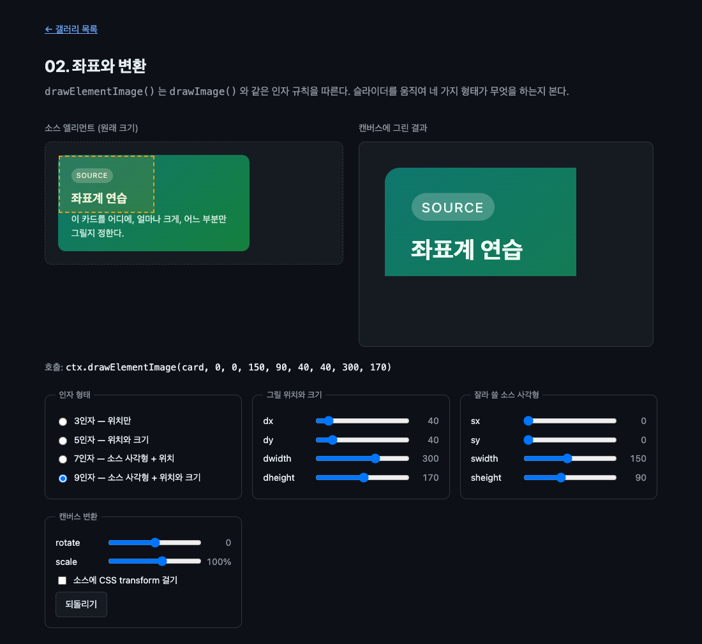

# 02. 좌표와 변환

`drawElementImage()` 의 인자 규칙, 캔버스 변환 행렬과의 관계, 그리고 소스 CSS transform 이 무시된다는 사실을 슬라이더로 확인한다.



> 이 문서의 측정값은 Chrome 151.0.7922.138 (macOS) 에서 2026-08-21 에 잰 것이다. 표준화 전 API 라 다음 버전에서 달라질 수 있다.

## 무엇을 배우나

- 인자 개수에 따라 의미가 달라진다. `drawImage()` 와 같은 규칙이다
- 크기를 생략하면 화면 밖에서와 같은 크기로 그려진다
- 캔버스의 현재 변환 행렬(CTM)은 그리기에 그대로 적용된다
- 소스 엘리먼트의 CSS `transform` 은 그리기에서 무시된다
- 넘치는 내용은 엘리먼트의 border box 로 잘린다

## 실행 방법

```bash
mise run serve
mise run chrome
```

`02-draw-geometry/` 로 들어간다. 왼쪽은 소스 엘리먼트의 원래 모습이고 오른쪽이 캔버스다. 왼쪽에 보이는 것은 복제본이다. 진짜 소스는 `<canvas>` 의 자식이라 화면에 직접 나오지 않는다.

## 핵심 코드

### 1. 네 가지 인자 형태

```js
ctx.drawElementImage(card, dx, dy); // 3인자
ctx.drawElementImage(card, dx, dy, dw, dh); // 5인자
ctx.drawElementImage(card, sx, sy, sw, sh, dx, dy); // 7인자
ctx.drawElementImage(card, sx, sy, sw, sh, dx, dy, dw, dh); // 9인자
```

`s` 로 시작하는 것은 소스(source), `d` 로 시작하는 것은 목적지(destination) 다. 소스 좌표는 엘리먼트 왼쪽 위 모서리를 원점으로 한다. 목적지 좌표는 캔버스 좌표계다.

| 형태  | 하는 일                                                        |
| ----- | -------------------------------------------------------------- |
| 3인자 | 원래 크기 그대로 `(dx, dy)` 에 그린다                          |
| 5인자 | `(dw, dh)` 크기로 늘리거나 줄여 그린다. 비율을 깨면 찌그러진다 |
| 7인자 | 소스의 일부만 잘라서 원래 크기 그대로 그린다                   |
| 9인자 | 잘라낸 영역을 원하는 크기로 늘려 그린다. 확대경처럼 쓸 수 있다 |

크기를 생략했을 때의 기본값이 그냥 "픽셀 크기" 가 아니라 "화면 밖에서와 같은 크기와 비율" 이라는 점이 중요하다. 캔버스 좌표계와 CSS 픽셀이 다를 때(고해상도 화면이나 `width` 속성과 CSS 크기가 다를 때) 이 차이가 드러난다.

### 2. 캔버스 변환은 적용된다

```js
const cx = stage.width / 2;
const cy = stage.height / 2;
ctx.translate(cx, cy);
ctx.rotate((deg * Math.PI) / 180);
ctx.scale(scale, scale);
ctx.translate(-cx, -cy);

ctx.drawElementImage(card, dx, dy);
```

`rotate` 슬라이더를 움직이면 카드가 통째로 돈다. `fillRect()` 나 `drawImage()` 와 똑같이 동작한다. 캔버스 좌표계를 먼저 옮겨 놓고 그리는 것이므로, 회전 중심을 바꾸고 싶으면 `translate` 기준점을 바꾸면 된다.

### 3. 소스의 CSS transform 은 무시된다

체크박스를 켜면 소스 엘리먼트에 `transform: rotate(12deg)` 가 걸린다.

```js
card.style.transform = 'rotate(12deg)';
```

캔버스 그림은 **하나도 바뀌지 않는다**. 확인해 봤다.

```text
DOM transform 값: rotate(12deg)
CSS transform 후 캔버스 픽셀 동일: true
```

DevTools 로 `#card` 를 선택해 보면 DOM 박스는 실제로 12도 돌아가 있다. 그림에는 반영되지 않는데 히트 테스트와 접근성에는 반영된다.

이 비대칭이 이상해 보이지만 의도된 설계다. 엘리먼트의 `transform` 을 "그린 위치와 DOM 위치를 맞추는 손잡이" 로 비워 둔 것이다. `drawElementImage()` 가 돌려주는 `DOMMatrix` 를 그 손잡이에 끼우면 클릭과 포커스가 그림을 따라온다. 그 방법은 [03. 인터랙티브 폼](../03-interactive-form/)에서 다룬다.

### 4. 슬라이더는 paint 를 부르지 않는다

```js
input.addEventListener('input', () => {
  // 슬라이더는 DOM 을 바꾸지 않으므로 paint 가 저절로 오지 않는다. 직접 요청한다.
  stage.requestPaint();
});
```

01 에서는 카드 내용을 바꿨기 때문에 `paint` 가 알아서 왔다. 여기서 바뀌는 것은 그리는 방법이지 엘리먼트가 아니다. 엘리먼트가 그대로면 브라우저는 다시 그릴 이유가 없다고 본다. 그래서 `requestPaint()` 를 직접 부른다.

## 직접 해볼 것

- 5인자에서 `dwidth` 만 늘려 보자. 글자가 가로로 늘어난다. 레이아웃을 다시 하는 것이 아니라 그려진 그림을 늘리는 것이다
- 9인자에서 `swidth` 와 `sheight` 를 작게 잡고 `dwidth` 와 `dheight` 를 크게 잡아 보자. 확대경이 된다
- `sx` 를 소스 폭보다 크게 잡아 보자. 빈 화면이 나온다
- `scale` 을 30% 로 줄이고 `rotate` 를 45도로 돌려 보자. 캔버스 변환이 소스 사각형과 어떻게 조합되는지 본다
- 소스 CSS transform 을 켠 채로 DevTools 에서 `#card` 를 선택해 보자. 파란 박스가 돌아가 있다

## 막히는 지점

| 증상 | 원인 |
| --- | --- |
| 슬라이더를 움직여도 그림이 안 바뀐다 | `requestPaint()` 를 부르지 않았다 |
| 카드 아래쪽이 잘린다 | 소스 사각형이 카드보다 작거나, 넘친 내용이 border box 에서 잘렸다 |
| 회전시켰더니 카드가 사라진다 | 캔버스 밖으로 나갔다. `translate` 기준점을 확인한다 |
| 소스에 transform 을 걸었는데 그림이 그대로다 | 정상이다. 설명서에 그렇게 적혀 있고 Chrome 151 에서도 그랬다 |

## 다음 예제

[03. 인터랙티브 폼](../03-interactive-form/) — 반환된 `DOMMatrix` 로 클릭, 포커스, 스크린리더를 그림에 맞춘다.
