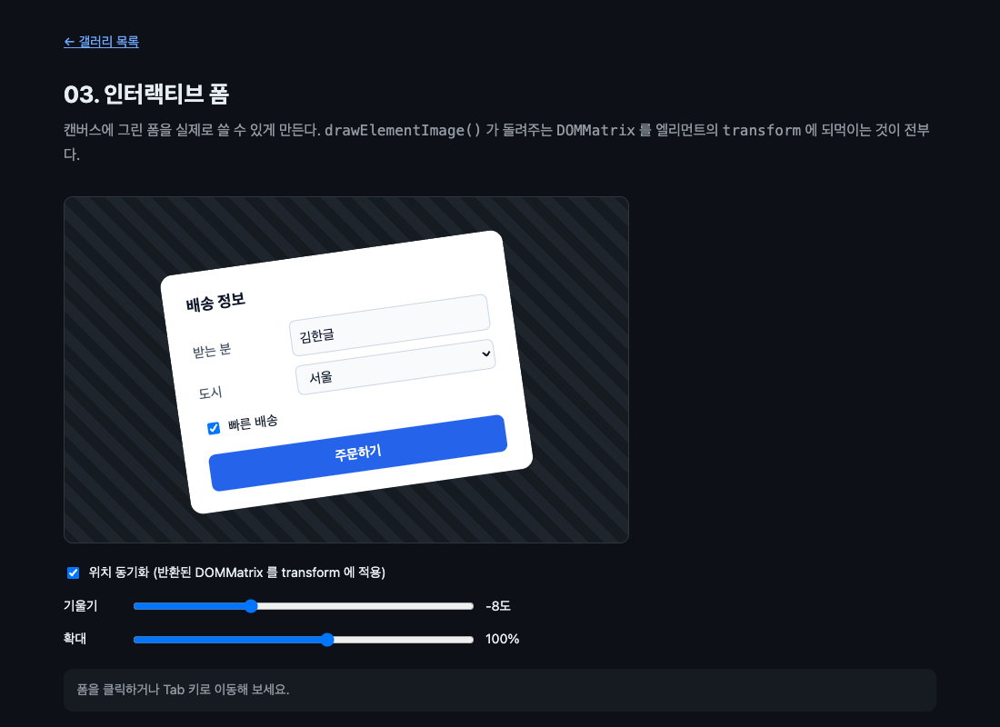

# 03. 인터랙티브 폼

캔버스에 그린 폼을 실제로 쓸 수 있게 만든다. 클릭, 포커스, 한글 입력, 스크린리더가 전부 살아난다.



> 이 문서의 측정값은 Chrome 151.0.7922.138 (macOS) 에서 2026-08-21 에 잰 것이다. 표준화 전 API 라 다음 버전에서 달라질 수 있다.

## 무엇을 배우나

- `drawElementImage()` 가 돌려주는 `DOMMatrix` 가 무엇을 뜻하는지
- 그 행렬을 `element.style.transform` 에 되먹여 DOM 위치를 그림에 맞추는 패턴
- 동기화를 안 하면 정확히 무엇이 깨지는지
- 왜 이 방법이 별도의 `placeElement()` 메서드보다 나은지

## 실행 방법

```bash
mise run serve
mise run chrome
```

`03-interactive-form/` 으로 들어간다. 폼을 클릭하고, Tab 키로 이동하고, 이름을 고쳐 보자. 그다음 "위치 동기화" 를 꺼 보자.

## 핵심 코드

### 1. 한 줄이 전부다

```js
const matrix = ctx.drawElementImage(panel, DRAW_X, DRAW_Y);
panel.style.transform = matrix.toString();
```

`drawElementImage()` 는 그냥 그리기만 하는 것이 아니라 `DOMMatrix` 를 돌려준다. 이 행렬의 뜻은 "이 엘리먼트를 방금 그린 자리로 옮기려면 이렇게 변환하라" 다. 그대로 엘리먼트의 `transform` 에 넣으면 DOM 박스가 그림 위로 이동한다.

실제로 찍히는 값은 이런 모양이다.

```text
matrix(0.990268, -0.139173, 0.139173, 0.990268, 120.379, 59.xxx)
```

캔버스에 걸어 둔 회전과 이동이 그대로 들어 있다.

### 2. 왜 무한 루프가 나지 않나

엘리먼트의 스타일을 바꾸면 `paint` 가 다시 오고, 그 안에서 또 스타일을 바꾸고... 이렇게 될 것 같지만 그렇지 않다. 02 에서 본 규칙 때문이다. 소스 엘리먼트의 CSS `transform` 은 그리기에 영향을 주지 않고, 따라서 렌더링이 바뀐 것으로 치지 않는다.

30프레임 동안 세어 봤다.

```text
30프레임 동안 추가 paint 횟수: 0
```

`transform` 자리가 비어 있던 이유가 이것이다. 그리기와 무관한 손잡이여야 여기에 위치를 써넣을 수 있다.

초기 제안의 `placeElement()` 대신 이 방식이 남은 데에는 이유가 있다. 행렬을 돌려주면 그리기와 위치 지정이 한 번에 끝나고, 캔버스에 걸어 둔 회전과 확대가 자동으로 반영된다. 무엇보다 **동기화할지 말지를 부르는 쪽이 정한다.** 이 예제의 토글이 그것이다. 장식으로만 그릴 때는 반환값을 버리면 되고, 상호작용이 필요할 때만 되먹이면 된다. 전용 메서드였다면 둘을 나누기 어려웠을 것이다.

### 3. 히트 테스트가 정말 따라오나

브라우저에게 직접 물어봤다. 입력칸의 화면 좌표 한가운데에서 `elementFromPoint()` 를 호출했다.

```text
동기화 켬 — 입력칸 중앙의 elementFromPoint: name
focus 후 activeElement: name
입력 로그: 입력: name = 테스트
버튼 클릭 결과: 주문 접수: 테스트 / 서울 / 빠른 배송 예
```

클릭이 먹고, 포커스가 가고, `FormData` 로 값이 읽힌다. 캔버스는 그림만 그렸을 뿐이고 폼은 처음부터 끝까지 진짜 DOM 이다.

### 4. 동기화를 끄면

```js
panel.style.transform = syncToggle.checked ? matrix.toString() : 'none';
```

끄면 폼의 DOM 박스가 원래 자리(캔버스 왼쪽 위)로 돌아간다. 그림은 그대로다.

```text
동기화 끔 — 입력칸 위치 이동량: 118px
동기화 껐다 켜도 그림 동일: true
```

118픽셀 떨어진 곳을 눌러야 입력칸이 반응한다. 보이는 곳을 눌러도 아무 일이 없다. 캔버스는 그림을 그리는 장치이고 클릭을 받는 것은 DOM 이라는 사실이 이때 드러난다.

### 5. 접근성은 공짜로 따라온다

폼은 `<canvas>` 의 fallback content 다. 스크린리더는 원래부터 이 자리를 읽는다. 그래서 따로 `aria-label` 을 만들거나 화면 밖 대체 텍스트를 관리할 필요가 없다. 지금까지 캔버스 앱이 접근성을 포기하거나 그림과 별개로 접근성 트리를 손으로 유지하던 문제가 여기서 사라진다.

`<label for="...">` 을 제대로 붙이는 것만 잊지 않으면 된다.

## 직접 해볼 것

- 동기화를 끄고 폼이 보이는 자리를 눌러 보자. 반응이 없다. 그다음 캔버스 왼쪽 위 근처를 눌러 보자
- 기울기를 25도로 놓고 입력칸을 눌러 보자. 기울어진 채로도 정확히 먹는다
- Tab 키를 눌러 폼을 순회해 보자. 포커스 링이 그림 위 제자리에 보인다
- 한글을 입력해 보자. 조합 중인 글자가 캔버스에 어떻게 나오는지 관찰한다. IME 팝업 자체는 read-back-allowed 규칙에 따라 캔버스에 그려지지 않는다
- VoiceOver 를 켜고(Command + F5) 폼을 읽어 보자. 라벨이 읽힐 것으로 보지만 아직 확인하지 못했다
- `matrix.toString()` 대신 `panel.style.transform = 'none'` 을 고정으로 넣고 무엇이 달라지는지 본다

## 막히는 지점

| 증상 | 원인 |
| --- | --- |
| 클릭이 엉뚱한 곳에서 먹는다 | 반환된 행렬을 `transform` 에 넣지 않았다 |
| 포커스 링이 딴 데 뜬다 | 같은 원인이다. 포커스 링은 DOM 박스를 따라간다 |
| 그림이 떨리거나 무한 루프가 돈다 | `transform` 이 아니라 `left`/`top` 이나 크기를 바꾸고 있다. 그것들은 레이아웃을 바꾸므로 다시 `paint` 를 부른다 |
| 캔버스 밖에서 폼이 겹쳐 보인다 | 캔버스 자식은 원래 화면에 나오지 않는다. 다른 요소가 겹친 것인지 확인한다 |

## 다음 예제

[04. paint 이벤트](../04-paint-event/) — `changedElements` 로 바뀐 것만 다시 그린다.
