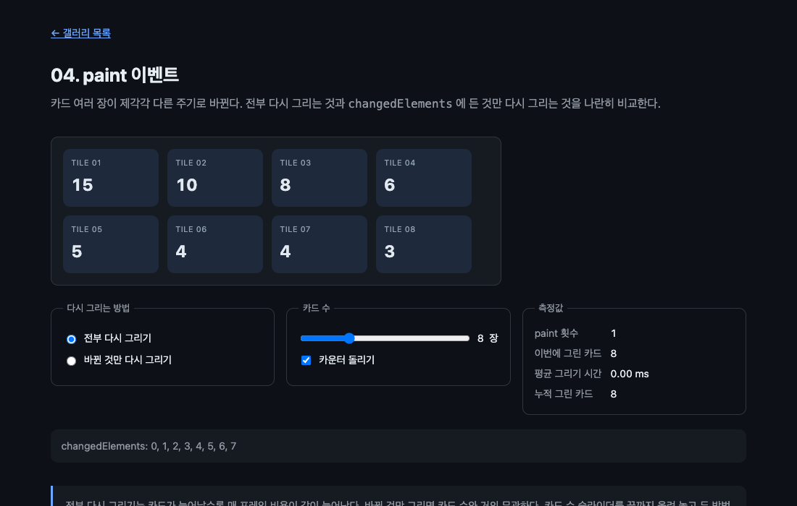

# 04. paint 이벤트

카드 여러 장이 제각각 다른 주기로 바뀐다. 매번 전부 다시 그리는 것과 `changedElements` 에 든 것만 다시 그리는 것을 나란히 비교한다.



> 이 문서의 측정값은 Chrome 151.0.7922.138 (macOS) 에서 2026-08-21 에 잰 것이다. 표준화 전 API 라 다음 버전에서 달라질 수 있다.

## 무엇을 배우나

- `paint` 이벤트가 언제 오는가
- `PaintEvent.changedElements` 로 바뀐 자식만 골라내는 법
- 부분 갱신을 하려면 무엇을 직접 관리해야 하는가
- `requestPaint()` 를 직접 불러야 하는 경우와 아닌 경우

## 실행 방법

```bash
mise run serve
mise run chrome
```

`04-paint-event/` 로 들어간다. 카드 수를 24장까지 올려 놓고 두 방법을 번갈아 고르면서 "누적 그린 카드" 를 본다.

## 핵심 코드

### 1. paint 는 알아서 온다

```js
tile.querySelector('.value').textContent = String(counters[index]);
```

카운터를 갱신하는 코드에 `requestPaint()` 가 없다. 자식의 렌더링이 바뀌면 브라우저가 알아서 `paint` 를 보낸다. 02 에서 슬라이더를 움직일 때 직접 불러야 했던 것과 대비된다. 규칙은 단순하다. **엘리먼트가 바뀌면 자동, 그리는 방법만 바뀌면 수동.**

### 2. changedElements 로 골라 그리기

```js
function onPaint(ctx, event) {
  const changed = Array.from(event.changedElements ?? []);

  if (mode === 'full' || needsFullRedraw) {
    ctx.reset();
    for (const tile of tiles) drawTile(ctx, tile);
    needsFullRedraw = false;
  } else {
    for (const element of changed) drawTile(ctx, element, true);
  }
}
```

부분 갱신에서는 `ctx.reset()` 을 부르지 않는다. 캔버스를 통째로 지우면 안 바뀐 카드까지 사라지기 때문이다. 대신 바뀐 카드의 자리만 지우고 다시 그린다.

```js
function drawTile(ctx, tile, clear = false) {
  const place = placements.get(tile);
  if (clear) ctx.clearRect(place.x, place.y, place.width, place.height);
  ctx.drawElementImage(tile, place.x, place.y);
}
```

여기서 대가가 드러난다. **어느 카드를 어디에 그렸는지 직접 기억해야 한다.** 이 예제는 `placements` 라는 `Map` 에 카드마다 `x`, `y`, `width`, `height` 를 넣어 둔다. 전부 다시 그리기에는 이런 장부가 필요 없다. 부분 갱신은 공짜가 아니다.

### 3. 얼마나 차이가 나나

카드 24장으로 120프레임 동안 재 봤다.

```text
카드 24장, 캔버스 높이: 572
[전부 다시] paint 20회 / 그린 카드 480장
[바뀐 것만] paint 19회 / 그린 카드 70장
```

거의 같은 시간 동안 480장 대 70장이다. 약 7분의 1이다. `paint` 횟수는 비슷하다. 이벤트가 오는 빈도는 같고 이벤트 하나당 하는 일이 다르다.

한 가지 솔직히 적어 둘 것이 있다. 이 예제에서 "평균 그리기 시간" 은 두 방법이 거의 같게 나온다. 카드가 작고 단순해서 그리기 자체가 워낙 싸기 때문이다. 카드 안에 그림자, 필터, 긴 텍스트가 들어가고 수가 수백 장이 되면 그때 시간 차이가 벌어진다. 지금 단계에서 믿을 만한 지표는 시간이 아니라 **그린 횟수** 다.

### 4. 바뀐 것이 없으면 빈 배열

```text
정지 후 requestPaint → (빈 배열)
```

카운터를 멈추고 `requestPaint()` 를 부르면 `paint` 는 오지만 `changedElements` 는 비어 있다. 이벤트가 왔다고 해서 무언가 바뀐 것은 아니다. 부분 갱신 코드는 이 경우 아무것도 그리지 않는다.

그래서 캔버스 크기를 바꾸거나 모드를 바꾼 직후처럼 "화면이 통째로 비었을 때" 를 따로 챙겨야 한다. 이 예제는 `needsFullRedraw` 플래그로 처리한다.

```js
if (stage.height !== needed) {
  stage.height = needed;
  needsFullRedraw = true;
}
```

`canvas.height` 를 건드리면 컨텍스트가 초기화되면서 그림이 전부 지워진다. 이건 이 API 와 무관한 캔버스의 원래 성질이다.

### 5. 알아 둘 규칙 두 가지

스펙에 적혀 있고 이 예제에서는 겉으로 드러나지 않는 것들이다.

- `paint` 는 역 트리 순서로 온다. 자손이 조상보다 먼저 받는다
- `paint` 핸들러 안에서 만든 DOM 변경은 이번 프레임이 아니라 다음 프레임에 반영된다

두 번째 규칙 때문에 `paint` 안에서 카운터를 올리면 화면에는 한 프레임 늦게 나타난다. `paint` 를 계산하는 자리로 쓰지 말라는 뜻이기도 하다.

## 직접 해볼 것

- 카드를 24장으로 올리고 두 모드의 "누적 그린 카드" 가 벌어지는 속도를 비교한다
- 부분 갱신 코드에서 `ctx.clearRect(...)` 줄을 지워 보자. 숫자가 겹쳐 찍힌다
- 부분 갱신에서 `ctx.reset()` 을 넣어 보자. 바뀐 카드 하나만 남고 나머지가 사라진다
- `placements` 를 갱신하지 않은 채로 카드 수를 바꿔 보자. 엉뚱한 자리를 지운다
- "카운터 돌리기" 를 끄고 `stage.requestPaint()` 를 콘솔에서 불러 보자. `changedElements` 가 빈 배열로 찍힌다

## 막히는 지점

| 증상 | 원인 |
| --- | --- |
| 부분 갱신에서 숫자가 겹쳐 보인다 | 그리기 전에 그 자리를 지우지 않았다 |
| 부분 갱신에서 카드가 하나만 남는다 | `ctx.reset()` 이나 `clearRect` 로 캔버스 전체를 지웠다 |
| 모드를 바꾸면 화면이 빈다 | 전체 다시 그리기를 한 번 태워 줘야 한다 |
| 캔버스 크기를 바꿨더니 다 사라진다 | 정상이다. `width`/`height` 변경은 컨텍스트를 초기화한다 |
| 카드를 추가했는데 안 그려진다 | `canvas` 의 직계 자식으로 넣었는지, 그릴 자리를 계산했는지 확인한다 |

## 다음 예제

[05. 다국어 텍스트](../05-international-text/) — 이 API 가 대신해 주는 일이 얼마나 큰지 텍스트로 확인한다.
