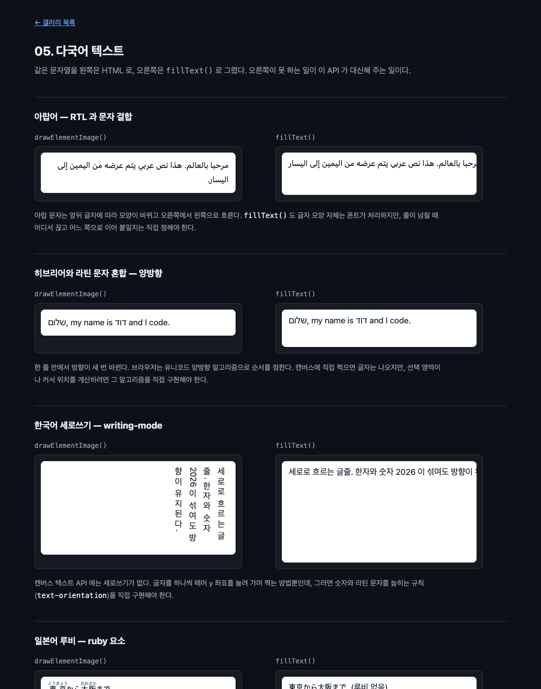

# 05. 다국어 텍스트

같은 문자열을 왼쪽은 HTML 로, 오른쪽은 `fillText()` 로 그려 나란히 놓는다. 오른쪽이 못 하는 일이 이 API 가 대신해 주는 일이다.



## 무엇을 배우나

- 캔버스 텍스트 API 의 한계가 구체적으로 어디까지인지
- 줄바꿈, 양방향, 세로쓰기, 루비, 폰트 폴백을 CSS 엔진에 맡긴다는 것의 의미
- `document.fonts.ready` 를 기다려야 하는 이유
- 글자가 그려지는 것과 텍스트를 다룰 수 있는 것은 다른 문제라는 것

## 실행 방법

```bash
mise run serve
mise run chrome
```

`05-international-text/` 로 들어간다. 표본 일곱 개가 위아래로 이어진다.

## 핵심 코드

### 1. 왼쪽은 이게 전부다

```js
canvas.layoutSubtree = true;
canvas.addEventListener(
  'paint',
  guardPaint(() => {
    ctx.reset();
    ctx.drawElementImage(specimen, 12, 12);
  }),
);
canvas.requestPaint();
```

표본이 아랍어든 세로쓰기든 루비든 코드가 같다. 다른 것은 HTML 쪽의 속성뿐이다.

```html
<div class="specimen" dir="rtl" lang="ar">مرحبا بالعالم…</div>
<div class="specimen" lang="ko" style="writing-mode: vertical-rl">세로로 흐르는 글줄…</div>
<div class="specimen" lang="ja">
  <ruby>東京<rt>とうきょう</rt></ruby
  >から…
</div>
```

### 2. 오른쪽도 이게 전부다

```js
ctx.font = "17px system-ui, 'Apple SD Gothic Neo', sans-serif";
ctx.textBaseline = 'top';
// 한 번만 찍는다. 캔버스 폭을 넘으면 그냥 잘린다.
ctx.fillText(canvas.dataset.text, 26, 26);
```

`fillText()` 에는 줄바꿈이 없다. `\n` 을 넣어도 줄이 바뀌지 않는다. 폭을 넘으면 잘린다.

### 3. 폰트 준비를 먼저 기다린다

```js
await document.fonts.ready;
```

이 줄이 없으면 폰트가 로드되기 전에 그려질 수 있다. 그러면 폴백 폰트로 잰 폭이 남고, 이후에 진짜 폰트가 오면 글자와 배치가 어긋난다. 왼쪽은 `paint` 가 다시 와서 저절로 고쳐지지만 오른쪽은 한 번 찍고 끝이라 그대로 남는다.

### 4. 무엇이 실제로 갈리나

솔직히 적어 두자면, 오른쪽 캔버스도 **글자 자체는 대부분 제대로 나온다.** 아랍 문자의 연결 모양도, 태국어 결합 문자도, 이모지도 폰트가 알아서 그린다. 글리프를 그리는 일은 어느 쪽이든 같은 폰트 엔진이 하기 때문이다.

갈리는 것은 그 위의 층이다.

| 표본 | `fillText()` 로 하려면 |
| --- | --- |
| 아랍어 RTL | 줄이 넘칠 때 어디서 끊고 어느 쪽으로 이어 붙일지 직접 정한다 |
| 히브리어 + 라틴 혼합 | 글자는 나오지만 선택 영역과 커서 위치를 계산하려면 유니코드 양방향 알고리즘을 직접 구현한다 |
| 세로쓰기 | 방법이 없다. 글자를 하나씩 떼어 y 를 늘려 가며 찍고, 숫자와 라틴 문자를 눕히는 규칙을 직접 만든다 |
| 루비 | 본문 글자 폭을 재고, 루비를 그 위 중앙에 놓고, 루비가 길면 본문 자간을 벌린다 |
| 태국어 | 어디서 줄을 끊을지 알려면 사전이 필요하다. 브라우저는 들고 있고 캔버스 API 는 없다 |
| 이모지 | 그리기는 되지만 폭 계산과 자르기가 어렵다 |
| 긴 문단 | `measureText()` 를 반복 호출하는 줄바꿈 루프를 직접 짠다 |

### 5. 이모지가 왜 까다로운가

가족 이모지 하나를 세어 봤다.

```js
const s = '👨‍👩‍👧‍👦';
s.length; // 11
[...s].length; // 7
[...new Intl.Segmenter('ko', { granularity: 'grapheme' }).segment(s)].length; // 1
```

사람 눈에는 한 글자인데 `length` 는 11 이다. 텍스트를 잘라 쓰는 코드가 `slice()` 를 쓰면 가족이 낱개로 쪼개진다. 캔버스에 직접 텍스트를 그리는 코드는 이런 계산을 전부 직접 해야 하고, HTML 에 맡기면 할 일이 없다.

## 직접 해볼 것

- 오른쪽 `fillText()` 문자열에 `\n` 을 넣어 보자. 줄이 바뀌지 않는다
- 세로쓰기 표본의 `writing-mode` 를 `horizontal-tb` 로 바꿔 보자. 왼쪽만 바뀐다
- 루비 표본에서 `<rt>` 안의 글자를 길게 늘려 보자. 본문 자간이 벌어진다
- `await document.fonts.ready` 를 지우고 웹폰트를 하나 추가해 보자. 오른쪽만 어긋난 채로 남는다
- 표본에 `text-emphasis: dot` 이나 `text-decoration: underline wavy` 를 걸어 보자. 왼쪽은 그대로 나온다

## 막히는 지점

| 증상 | 원인 |
| --- | --- |
| 왼쪽 글자가 잘린다 | 표본이 캔버스보다 크다. 넘친 내용은 border box 에서 잘린다 |
| 폰트가 다르게 보인다 | 왼쪽은 CSS `font-family`, 오른쪽은 `ctx.font` 다. 둘을 같은 값으로 맞춰야 비교가 된다 |
| 세로쓰기 표본이 잘린다 | `writing-mode` 를 쓸 때는 높이를 직접 정해 줘야 한다 |
| 웹폰트가 늦게 적용된다 | `document.fonts.ready` 를 기다리지 않았다 |

## 다음 예제

[06. 이미지 내보내기](../06-image-export/) — 그린 것을 PNG 파일로 뽑는다.
