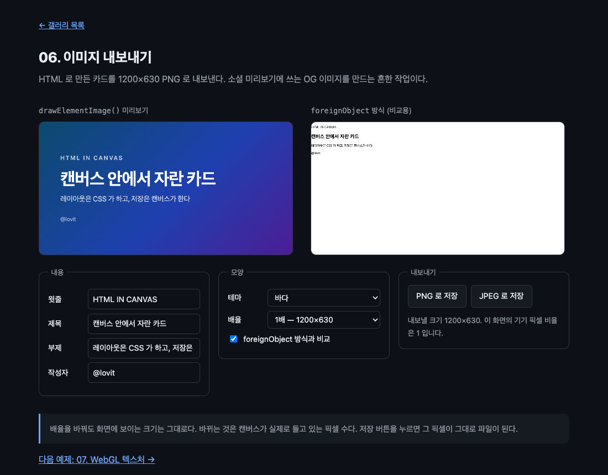

# 06. 이미지 내보내기

HTML 로 만든 카드를 1200×630 PNG 로 뽑는다. 소셜 미리보기용 OG 이미지를 만드는 흔한 작업이다.



> 이 문서의 측정값은 Chrome 151.0.7922.138 (macOS) 에서 2026-08-21 에 잰 것이다. 표준화 전 API 라 다음 버전에서 달라질 수 있다.

## 무엇을 배우나

- `canvas.toBlob()` 으로 PNG 와 JPEG 내보내기
- 보이는 크기와 백킹 스토어 해상도를 분리해 배율을 다루는 법
- `devicePixelRatio` 를 어떻게 반영할지
- `document.fonts.ready` 를 기다려야 하는 이유
- 기존 `foreignObject` 우회로와 무엇이 다른지

## 실행 방법

```bash
mise run serve
mise run chrome
```

`06-image-export/` 로 들어간다. 내용을 고치면 미리보기가 따라온다. "PNG 로 저장" 을 누르면 파일이 내려받아진다.

## 핵심 코드

### 1. 보이는 크기와 픽셀 수를 분리한다

```css
/* 보이는 크기는 CSS 가 정한다 */
#stage {
  width: 100%;
  max-width: 460px;
  aspect-ratio: 1200 / 630;
}
```

```js
// 실제로 들고 있는 픽셀 수는 배율이 정한다
stage.width = CARD_WIDTH * scale;
stage.height = CARD_HEIGHT * scale;
```

캔버스의 `width` / `height` 속성은 백킹 스토어, 즉 실제 픽셀 수다. CSS 의 `width` / `height` 는 화면에 차지하는 크기다. 이 둘을 따로 두면 화면 크기는 그대로 두고 결과물 해상도만 키울 수 있다.

카드 자체는 항상 1200×630 이다. 그리는 쪽에서 캔버스 크기에 맞춰 늘린다.

```js
ctx.drawElementImage(card, 0, 0, stage.width, stage.height);
```

02 에서 본 5인자 형태다.

### 2. 크기를 바꾸면 다시 그려야 한다

```js
stage.width = CARD_WIDTH * scale;
stage.height = CARD_HEIGHT * scale;
// width/height 를 바꾸면 컨텍스트가 초기화된다. 다시 그려 달라고 요청한다.
stage.requestPaint();
```

`canvas.width` 를 건드리면 캔버스가 초기화되면서 그림이 사라진다. 04 에서도 같은 함정을 만났다.

### 3. 내보내기

```js
stage.toBlob((blob) => {
  if (!blob) {
    status.textContent = '내보내기에 실패했습니다. 캔버스가 오염되지 않았는지 확인하세요.';
    return;
  }
  const url = URL.createObjectURL(blob);
  const link = document.createElement('a');
  link.href = url;
  link.download = `og-card-${stage.width}x${stage.height}.png`;
  link.click();
  URL.revokeObjectURL(url);
}, 'image/png');
```

`toBlob()` 이 성공한다는 것은 캔버스가 오염되지 않았다는 뜻이다. 같은 출처 콘텐츠만 그렸다면 `drawElementImage()` 는 캔버스를 오염시키지 않는다. 교차 출처 이미지가 섞이면 이야기가 달라지는데, 그 규칙은 [09. 무엇이 그려지지 않나](../09-security-limits/)에서 다룬다.

실제로 재 본 크기다.

```text
1배 PNG: 1200x630, 723 KB
2배 PNG: 2400x1260, 2442 KB
2배 JPEG: 2400x1260, 124 KB
```

그라디언트 배경 때문에 PNG 가 무겁다. 사진이나 그라디언트가 많은 카드는 JPEG 가 20분의 1 수준이다. 반대로 단색 배경에 글자만 있는 카드는 PNG 가 더 작고 선명하다.

### 4. devicePixelRatio 는 화면용이지 파일용이 아니다

```js
const dpr = window.devicePixelRatio;
```

헷갈리기 쉬운 지점이다. `devicePixelRatio` 는 **화면에 선명하게 보이려면** 몇 배로 그려야 하는지를 알려 주는 값이다. 내보낼 파일 크기와는 상관이 없다. OG 이미지는 규격이 1200×630 으로 정해져 있으니 파일은 1배로 뽑으면 된다.

이 예제는 두 목적을 한 캔버스로 겸하고 있어서 배율 하나가 둘 다에 걸린다. 실무에서 나눈다면 미리보기용 캔버스는 `devicePixelRatio` 를 따르고, 내보내기는 규격 크기에 맞추는 편이 낫다.

### 5. 예전 방식과 비교

체크박스를 켜면 오른쪽에 `foreignObject` 방식이 나온다.

```js
const serialized = new XMLSerializer().serializeToString(card);
const svg = `<svg xmlns="http://www.w3.org/2000/svg" width="1200" height="630"><foreignObject width="100%" height="100%"><div xmlns="http://www.w3.org/1999/xhtml">${serialized}</div></foreignObject></svg>`;
image.src = `data:image/svg+xml;charset=utf-8,${encodeURIComponent(svg)}`;
```

결과는 스크린샷에서 보는 대로다. 그라디언트도, 글자 크기도, 여백도 전부 사라지고 기본 스타일의 글자만 남는다. **외부 스타일시트가 따라오지 않기 때문이다.** 제대로 나오게 하려면 페이지의 모든 CSS 규칙 중 이 카드에 적용되는 것을 찾아 인라인으로 풀어 넣어야 한다. `html-to-image` 같은 라이브러리가 하는 일이 정확히 그것이고, 그래서 웹폰트와 의사 요소에서 자주 어긋난다.

`drawElementImage()` 는 브라우저가 이미 계산해 둔 렌더링 결과를 그대로 쓴다. 직렬화도, CSS 수집도 없다.

## 직접 해볼 것

- 배율을 3배로 올리고 저장해 보자. 파일 크기와 실제 픽셀 수를 확인한다
- 테마를 바꿔 가며 PNG 와 JPEG 크기를 비교해 보자. 흑백 테마에서 차이가 줄어든다
- 카드 CSS 에 `box-shadow` 나 `backdrop-filter` 를 추가하고 두 방식을 비교해 보자
- `await document.fonts.ready` 를 지우고 새로고침을 반복해 보자
- 카드 안에 교차 출처 이미지를 넣고 저장해 보자. 무슨 일이 생기는지는 09 에서 다룬다

## 막히는 지점

| 증상                            | 원인                                                |
| ------------------------------- | --------------------------------------------------- |
| 저장한 이미지가 흐리다          | 백킹 스토어가 작다. 배율을 올린다                   |
| 배율을 바꾸면 화면이 빈다       | `canvas.width` 변경 후 다시 그리지 않았다           |
| `toBlob` 이 `null` 을 준다      | 캔버스가 오염됐다. 교차 출처 콘텐츠가 섞였는지 본다 |
| 글자가 조금씩 어긋난다          | 폰트가 준비되기 전에 그렸다                         |
| foreignObject 쪽이 텅 비어 있다 | 스타일이 따라오지 않아서다. 그게 이 비교의 요점이다 |

## 다음 예제

[07. WebGL 텍스처](../07-webgl-texture/) — HTML 을 GPU 텍스처로 올려 셰이더로 주무른다.
