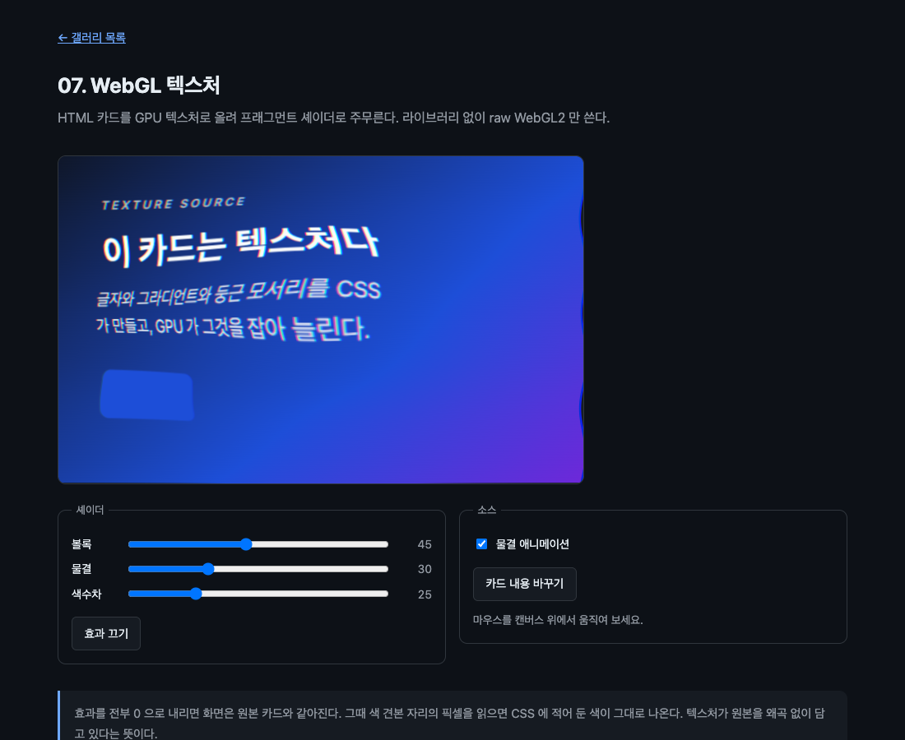

# 07. WebGL 텍스처

HTML 카드를 GPU 텍스처로 올려 프래그먼트 셰이더로 주무른다. 라이브러리 없이 raw WebGL2 만 쓴다.



> 이 문서의 측정값은 Chrome 151.0.7922.138 (macOS) 에서 2026-08-21 에 잰 것이다. 표준화 전 API 라 다음 버전에서 달라질 수 있다.

## 무엇을 배우나

- `gl.texElementImage2D()` 로 엘리먼트를 텍스처에 올리는 법
- 왜 업로드를 `paint` 안에서 해야 하는지
- `internalformat` 으로 아무 값이나 넣을 수 없다는 것
- 텍스처 업로드와 매 프레임 렌더링을 분리하는 구조
- 텍스처가 원본 색을 그대로 담는지 픽셀로 확인하는 법

## 실행 방법

```bash
mise run serve
mise run chrome
```

`07-webgl-texture/` 로 들어가서 캔버스 위에 마우스를 올리고 움직여 보자. 슬라이더로 효과 강도를 조절할 수 있다.

## 핵심 코드

### 1. 대상은 여기서도 직계 자식

```html
<canvas id="gl" width="640" height="400">
  <div id="card">…</div>
</canvas>
```

WebGL 캔버스라고 규칙이 달라지지 않는다. `layoutSubtree` 를 켜고, 그릴 대상은 캔버스의 직계 자식이어야 한다.

### 2. 업로드는 paint 안에서

```js
canvas.addEventListener(
  'paint',
  guardPaint(() => uploadTexture(gl, texture)),
);
canvas.requestPaint();
```

처음에 이 예제를 짤 때 텍스처 업로드를 `requestAnimationFrame` 루프 안에 넣었다가 이 에러를 만났다.

```text
InvalidStateError: Failed to execute 'texElementImage2D' on 'WebGL2RenderingContext':
No cached paint record for element.
```

01 에서 만난 것과 같은 규칙이다. 브라우저는 자식의 렌더링 결과를 스냅샷으로 들고 있다가 넘겨주는데, `paint` 바깥에서는 그 스냅샷이 유효하지 않다. `drawElementImage()` 든 `texElementImage2D()` 든 마찬가지다.

그래서 구조가 이렇게 갈린다.

| 언제             | 무엇을                                               |
| ---------------- | ---------------------------------------------------- |
| `paint` 가 올 때 | 텍스처를 다시 올린다. 카드 내용이 바뀌었을 때만 온다 |
| 매 프레임        | 이미 올라간 텍스처로 그린다. 마우스와 시간만 바뀐다  |

카드 내용이 안 바뀌면 업로드는 한 번도 일어나지 않고, 셰이더 효과는 화면 주사율대로 계속 돈다. 비싼 일과 싼 일이 자연스럽게 나뉜다.

### 3. internalformat 은 아무거나 안 된다

```js
gl.texElementImage2D(gl.TEXTURE_2D, gl.RGBA8, card, {
  width: canvas.width,
  height: canvas.height,
});
```

`gl.RGBA` 를 넘기면 거부된다.

```text
TypeError: Failed to execute 'texElementImage2D' on 'WebGL2RenderingContext':
Invalid internalformat. Must be one of RGBA8, SRGB8_ALPHA8, RGBA16F, or RGBA32F.
```

크기가 정해진 형식만 받는다. 색 공간을 신경 쓴다면 `SRGB8_ALPHA8` 을 쓸 수 있고, HDR 합성을 한다면 `RGBA16F` 를 쓴다. 네 번째 인자 `config` 는 생략할 수 있다. 넣으면 `sx`, `sy`, `swidth`, `sheight` 로 소스 일부만 잘라 쓰고 `width`, `height` 로 텍스처 크기를 정한다. 2D 컨텍스트의 소스 사각형과 같은 개념이다.

### 4. 텍스처가 원본을 그대로 담는가

카드 안에 정확히 `#1d4ed8` 인 색 견본을 하나 두었다. 효과를 전부 0 으로 내리고 그 자리의 픽셀을 읽어 봤다.

```text
효과 0일 때 색 견본 픽셀: rgb(29,78,216)  기대값 rgb(29,78,216)
원본 색 일치: true
```

`#1d4ed8` 은 십진수로 `rgb(29, 78, 216)` 이다. 한 값도 어긋나지 않는다. `RGBA8` 로 올리면 색 변환이 끼지 않는다는 뜻이다. `SRGB8_ALPHA8` 로 바꾸면 셰이더가 읽는 값이 선형 공간으로 바뀌므로 이 숫자가 달라진다.

### 5. 셰이더

```glsl
vec2 warp(vec2 point) {
  vec2 offset = point - pointer;
  float distance = length(offset);
  float push = 1.0 - bulge * exp(-distance * distance * 16.0);
  vec2 warped = pointer + offset * push;
  warped.x += wave * 0.02 * sin(warped.y * 22.0 + time * 2.2);
  return warped;
}
```

마우스 근처일수록 `exp()` 값이 커지고, 그만큼 좌표를 안쪽으로 당긴다. 결과적으로 마우스 주변이 확대된다. 색수차는 R 과 B 채널을 좌우로 조금 어긋나게 뽑아 만든다.

텍스처는 위아래가 뒤집혀 올라오므로 정점 셰이더에서 `uv.y` 를 뒤집는다.

```glsl
uv = vec2(position.x * 0.5 + 0.5, 0.5 - position.y * 0.5);
```

화면을 덮는 도형으로는 삼각형 하나를 쓴다. 사각형 두 개보다 정점이 적고 대각선 이음매가 없다.

## 직접 해볼 것

- "효과 끄기" 를 누르고 원본 카드와 비교해 보자
- "카드 내용 바꾸기" 를 눌러 보자. 셰이더 코드는 그대로인데 텍스처만 바뀐다
- `gl.RGBA8` 을 `gl.SRGB8_ALPHA8` 로 바꿔 보자. 색이 어두워진다. 셰이더가 읽는 값이 선형 공간으로 바뀌는데 그대로 화면에 쓰기 때문이다
- 텍스처 업로드를 `paint` 밖으로 옮겨 보자. `No cached paint record` 를 직접 만난다
- `TEXTURE_MAG_FILTER` 를 `NEAREST` 로 바꾸고 볼록 강도를 올려 보자. 확대되는 자리라 글자가 계단처럼 깨진다
- 정점 셰이더의 `uv.y` 뒤집기를 없애 보자. 카드가 거꾸로 나온다

## 막히는 지점

| 증상 | 원인 |
| --- | --- |
| `No cached paint record for element` | `paint` 밖에서 텍스처를 올렸다 |
| `Invalid internalformat` | `gl.RGBA` 를 넘겼다. `gl.RGBA8` 을 쓴다 |
| 화면이 까맣다 | 텍스처가 비었거나, 셰이더 링크에 실패했거나, `drawArrays` 를 부르지 않았다 |
| 카드가 거꾸로 나온다 | 텍스처 y 축을 뒤집지 않았다 |
| 내용을 바꿨는데 그대로다 | `paint` 가 오는지 확인한다. 업로드가 그 안에 있어야 한다 |
| 헤드리스에서 WebGL2 가 없다 | `--use-angle=swiftshader` 를 붙인다 |

## 다음 예제

[08. OffscreenCanvas 워커](../08-offscreen-worker/) — 스냅샷을 워커로 넘겨 메인 스레드를 비운다.
