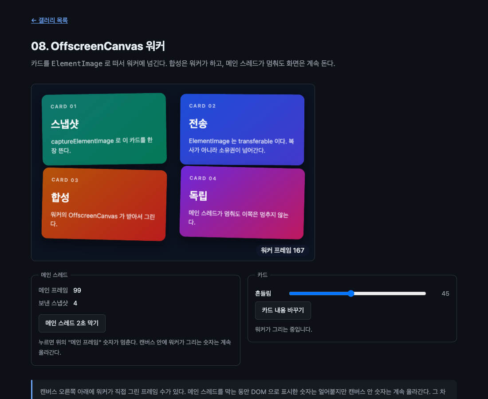

# 08. OffscreenCanvas 워커

카드를 `ElementImage` 로 떠서 워커에 넘긴다. 합성은 워커가 하고, 메인 스레드가 멈춰도 화면은 계속 돈다.



> 이 문서의 측정값은 Chrome 151.0.7922.138 (macOS) 에서 2026-08-21 에 잰 것이다. 표준화 전 API 라 다음 버전에서 달라질 수 있다.

## 무엇을 배우나

- `canvas.captureElementImage()` 로 스냅샷을 뜨는 법
- `ElementImage` 가 transferable 이라는 것과 넘긴 뒤에 생기는 일
- 워커의 `OffscreenCanvasRenderingContext2D` 에서 그리는 법
- **`ElementImage` 는 그것을 뜬 캔버스에만 그릴 수 있다**는 제약
- 스냅샷 뜨기와 합성을 스레드로 나누는 구조

## 실행 방법

```bash
mise run serve
mise run chrome
```

`08-offscreen-worker/` 로 들어가서 "메인 스레드 2초 막기" 를 눌러 보자. 왼쪽 "메인 프레임" 숫자는 멈추는데 캔버스 오른쪽 아래 "워커 프레임" 숫자는 계속 올라간다.

## 핵심 코드

### 1. 캔버스 하나로 두 가지를 한다

```js
stage.layoutSubtree = true;

// 제어권을 워커에 넘긴다. 이 순간부터 메인 스레드는 이 캔버스에 직접 그릴 수 없다.
const offscreen = stage.transferControlToOffscreen();
worker.postMessage({ type: 'canvas', canvas: offscreen }, [offscreen]);
```

제어권을 넘겼는데도 두 가지가 그대로 남는다.

- 자식 엘리먼트는 DOM 에 그대로 있다
- `paint` 이벤트는 여전히 이 캔버스로 온다

그래서 메인 스레드는 "그릴 수는 없지만 스냅샷은 뜰 수 있는" 상태가 된다. 이 예제의 구조가 이렇게 잡힌 이유가 있다.

### 2. 왜 캔버스를 하나만 쓰나

처음에는 캔버스를 둘로 나눠 만들었다. 자식을 담는 캔버스와 워커가 그릴 캔버스를 따로 두는 편이 자연스러워 보였다. 결과는 이랬다.

```text
InvalidStateError: Failed to execute 'drawElementImage' on 'OffscreenCanvasRenderingContext2D':
The source was captured from a different canvas.
```

`ElementImage` 는 아무 데나 그릴 수 없다. **뜬 캔버스에만 그릴 수 있다.** 그래서 자식을 담은 캔버스가 곧 워커에 넘길 캔버스여야 한다.

### 3. 스냅샷은 paint 안에서

```js
stage.addEventListener(
  'paint',
  guardPaint((event) => {
    const changed = Array.from(event.changedElements ?? []);
    // 처음에는 changedElements 가 전부를 담고 있다. 이후에는 바뀐 카드만 온다.
    const targets = changed.length > 0 ? changed : cards;
    for (const card of targets) sendSnapshot(worker, card);
  }),
);
```

`captureElementImage()` 도 `paint` 안에서 불러야 한다. 밖에서 부르면 스냅샷 기록이 없다며 거부한다. 01, 07 에서 만난 규칙과 같다.

`layoutSubtree` 를 켜기 전에 부르면 다른 메시지가 나온다.

```text
InvalidStateError: captureElementImage requires the canvas to have the layoutsubtree attribute.
```

04 에서 배운 `changedElements` 를 여기서 다시 쓴다. 카드 하나만 바뀌면 그 한 장만 새로 떠서 보낸다.

### 4. 소유권이 넘어간다

```js
const image = stage.captureElementImage(card);
// 두 번째 인자가 transfer 목록이다. 복사가 아니라 소유권이 넘어간다.
worker.postMessage({ type: 'image', index, image }, [image]);
```

`postMessage` 의 두 번째 인자에 넣으면 복사 없이 넘어간다. 대신 이쪽 것은 못 쓰게 된다. 실제로 확인해 봤다.

```text
capture 직후: 288x48
transfer 직후 메인 쪽 width: 0
워커 쪽 수신: ElementImage 288x48
```

넘긴 뒤 메인 스레드의 객체는 껍데기만 남는다. transfer 목록에서 빼면 복사가 일어나는데, 스냅샷은 크기가 커서 복사 비용이 아깝다.

### 5. 워커 쪽

```js
images.get(message.index)?.close();
images.set(message.index, message.image);
```

새 스냅샷이 오면 그 자리에 있던 옛것을 `close()` 한다. 안 닫으면 이미지가 계속 쌓인다. 닫힌 뒤에는 `width` 가 0 이 된다.

```js
ctx.drawElementImage(image, -image.width / 2, -image.height / 2);
```

워커에서는 엘리먼트가 아니라 `ElementImage` 를 넘긴다. 함수 이름과 인자 규칙은 같다. 워커는 DOM 을 모르지만 그림 조각은 다룰 수 있다.

워커에서 `requestAnimationFrame` 을 쓸 수 있는지 확인해 봤다. Chrome 151 에서는 있다. 없는 환경을 대비해 타이머로 물러설 길을 둔다.

```js
const schedule =
  typeof requestAnimationFrame === 'function'
    ? requestAnimationFrame
    : (callback) => setTimeout(callback, 16);
```

### 6. 정말 안 멈추나

"메인 스레드 2초 막기" 는 이렇게 생겼다.

```js
const until = performance.now() + 2000;
while (performance.now() < until) {
  // 일부러 아무것도 하지 않고 붙잡고 있는다.
}
```

측정해 봤다.

```text
막기 호출이 붙잡은 시간: 2000ms
막는 동안 메인 프레임 증가: 0
```

메인 스레드의 `requestAnimationFrame` 은 2초 동안 한 번도 돌지 않았다. 그동안 워커는 자기 프레임을 계속 그린다. 프레임 수를 DOM 이 아니라 **캔버스 안에** 그리는 이유가 이것이다. DOM 으로 표시하면 메인 스레드가 멈춘 동안 갱신되지 않아서 증거가 되지 못한다.

## 직접 해볼 것

- "메인 스레드 2초 막기" 를 누르고 두 숫자를 비교해 보자
- "카드 내용 바꾸기" 를 누르고 "보낸 스냅샷" 이 몇 개 늘어나는지 본다
- 워커에서 `image.close()` 줄을 지우고 카드를 여러 번 바꿔 보자. 메모리가 늘어난다
- `postMessage` 의 transfer 목록을 비우고 넘긴 뒤 `image.width` 를 찍어 보자
- 캔버스를 둘로 나눠 보자. `The source was captured from a different canvas` 를 직접 만난다

## 막히는 지점

| 증상 | 원인 |
| --- | --- |
| `The source was captured from a different canvas` | 스냅샷을 뜬 캔버스와 그리는 캔버스가 다르다 |
| `captureElementImage requires the canvas to have the layoutsubtree attribute` | `layoutSubtree` 를 켜기 전에 불렀다 |
| `No cached paint record` | `paint` 밖에서 스냅샷을 떴다 |
| 넘긴 이미지의 크기가 0 이다 | transfer 된 뒤 메인 쪽에서 읽었거나 `close()` 한 뒤다 |
| 캔버스가 비어 있고 조용하다 | 워커 스크립트를 못 불러왔다. `worker.addEventListener('error', …)` 를 달아 둔다 |
| 메인 스레드에서 `getContext` 가 실패한다 | 제어권을 이미 워커에 넘겼다 |

## 다음 예제

[09. 무엇이 그려지지 않나](../09-security-limits/) — 브라우저가 일부러 빼는 것들을 직접 확인한다.
