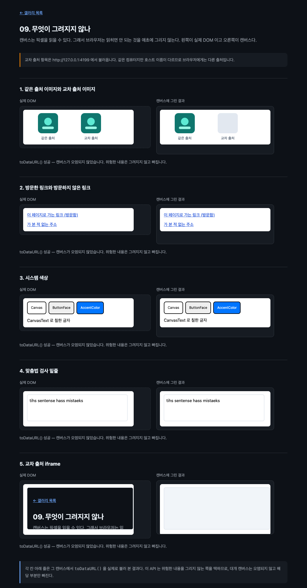

# 09. 무엇이 그려지지 않나

캔버스는 픽셀을 읽을 수 있다. 그래서 브라우저는 읽히면 정보가 새는 것을 애초에 그리지 않는다. 무엇이 빠지는지 직접 부딪혀 본다.



## 무엇을 배우나

- read-back-allowed rendering 이 무엇을 걸러 내는지
- 캔버스를 오염시키는 대신 해당 부분만 빼는 설계
- 외부 서버 없이 교차 출처 상황을 만드는 법
- 스펙에 적힌 것과 실제로 관찰되는 것이 다를 수 있다는 것

## 실행 방법

```bash
mise run serve
mise run chrome
```

`09-security-limits/` 로 들어간다. **이 예제는 `file://` 로 열면 절반이 동작하지 않는다.** 교차 출처를 만들 수 없기 때문이다.

## 교차 출처를 만드는 법

외부 서버를 부르지 않고 교차 출처를 만든다. `localhost` 와 `127.0.0.1` 은 같은 컴퓨터를 가리키지만 브라우저에게는 다른 출처다.

```js
function crossOrigin() {
  const { protocol, hostname, port } = location;
  if (protocol !== 'http:' && protocol !== 'https:') return null;
  const other = hostname === 'localhost' ? '127.0.0.1' : 'localhost';
  return `${protocol}//${other}${port ? `:${port}` : ''}`;
}
```

같은 서버, 같은 파일인데 호스트 이름만 다르다. 인터넷 연결도, 외부 의존성도 필요 없다.

## 확인 결과

Chrome 151.0.7922.138 / macOS / 헤드리스 (`--enable-blink-features=CanvasDrawElement`) 에서 확인했다.

| 항목             | 실제 DOM   | 캔버스        | 판정               |
| ---------------- | ---------- | ------------- | ------------------ |
| 같은 출처 이미지 | 보인다     | 보인다        | 그려짐             |
| 교차 출처 이미지 | 보인다     | **빈 자리**   | 빠짐               |
| 교차 출처 iframe | 보인다     | **완전히 빔** | 빠짐               |
| 시스템 색상      | 보인다     | 보인다        | 그려짐 (아래 설명) |
| 방문한 링크 색   | 확인 못 함 | 확인 못 함    | 판정 불가          |
| 맞춤법 밑줄      | 확인 못 함 | 확인 못 함    | 판정 불가          |

교차 출처 항목 두 가지는 분명하다. 이미지는 대체 자리만 남고, iframe 은 통째로 비어 나온다. 그런데도 `toDataURL()` 은 다섯 칸 모두에서 성공했다.

```text
toDataURL() 성공 — 캔버스가 오염되지 않았습니다.
```

이것이 이 API 의 설계다. **캔버스를 오염시키는 대신 위험한 부분만 그리지 않는다.** 그려 놓고 읽기를 막는 것이 아니라 애초에 안 그린다. 그래서 카드 하나에 교차 출처 이미지가 섞여도 나머지는 그대로 내보낼 수 있다.

### 시스템 색상이 그려진 이유

스펙은 "시스템 색상, 테마, 사용자 설정" 을 제외 대상으로 적고 있다. 그런데 확인해 보면 양쪽이 똑같이 나온다.

새는 정보가 없기 때문이라고 보는 편이 자연스럽다. 지키려는 것은 "이 사용자가 시스템 색을 바꿔 놓았다" 는 사실이고, 기본값을 쓰는 사용자에게는 숨길 것이 없다. 고대비 모드나 강제 색상 모드를 켠 뒤 다시 보면 결과가 달라질 수 있다. 직접 확인해 볼 만한 지점이다.

### 판정 불가라고 적은 이유

방문한 링크와 맞춤법 밑줄은 헤드리스 환경에서 **왼쪽 DOM 쪽에도 나타나지 않았다.** 비교 대상이 없으니 캔버스에서 빠졌는지 원래 없었는지 구분할 수 없다. 헤드리스는 방문 기록 데이터베이스와 맞춤법 검사기를 쓰지 않는 것으로 보인다.

평소 쓰는 Chrome 창에서 열어 보면 다르게 나올 것이다. 이 저장소가 "직접 열어 보라" 고 하는 이유이기도 하다.

### 곁가지로 확인한 것

`:visited` 를 JavaScript 로 읽어 보려 했더니 이렇게 나왔다.

```js
getComputedStyle(visitedLink).color; // rgb(29, 78, 216)
getComputedStyle(unvisitedLink).color; // rgb(29, 78, 216)
```

브라우저는 `getComputedStyle()` 에게도 방문하지 않은 색을 알려 준다. 방문 기록 유출을 막는 오래된 장치다. 캔버스에서 `:visited` 를 빼는 것도 같은 계열의 방어다. 화면에는 보여 주되 코드가 읽을 수 있는 통로는 전부 막는다.

## 그려지지 않는 것 전체 목록

스펙이 제외 대상으로 적어 둔 것들이다.

- 교차 출처 콘텐츠 (`<iframe>`, ``, `url()` 참조)
- `:visited` 방문 기록 스타일
- 시스템 색상, 테마, 사용자 설정
- 맞춤법과 문법 검사 표시
- JavaScript 가 원래 못 읽는 자동완성 대기 값
- 서브픽셀 안티에일리어싱
- IME 팝업과 IME 전용 서식
- 자막 관련 사용자 설정

반대로 허용되는 것도 있다. 검색 하이라이트, 스크롤바 모양, 캐럿 깜빡임 주기, `forced-colors` 미디어 쿼리.

## 직접 해볼 것

- 평소 쓰는 Chrome 창(플래그를 켠)에서 열어 방문한 링크와 맞춤법 밑줄을 다시 확인해 보자
- 시스템 설정에서 강조 색을 바꾸고 다시 열어 보자
- macOS 손쉬운 사용에서 대비를 높이고 다시 열어 보자
- 교차 출처 이미지를 카드 안에 넣고 [06. 이미지 내보내기](../06-image-export/) 처럼 저장해 보자. 이미지만 빠진 채로 저장된다
- `crossOrigin()` 이 돌려주는 주소를 `localhost` 로 바꿔 보자. 같은 출처가 되어 이미지가 그려진다

## 막히는 지점

| 증상 | 원인 |
| --- | --- |
| 교차 출처 항목이 왼쪽에서도 안 보인다 | `file://` 로 열었다. `mise run serve` 로 띄운다 |
| 이미지 자리가 비어 있다 | 정상이다. 교차 출처라서 빠진 것이다 |
| `toDataURL()` 이 실패한다 | 이 API 밖에서 교차 출처 이미지를 `drawImage()` 로 그렸을 것이다 |
| DOM 과 캔버스가 똑같아 보인다 | 그 항목은 유출할 정보가 없어서 그대로 그려진 것일 수 있다 |

## 다음 예제

[10. 접근성 있는 차트](../10-accessible-chart/) — 지금까지 배운 것을 모아 쓸 만한 것을 만든다.
