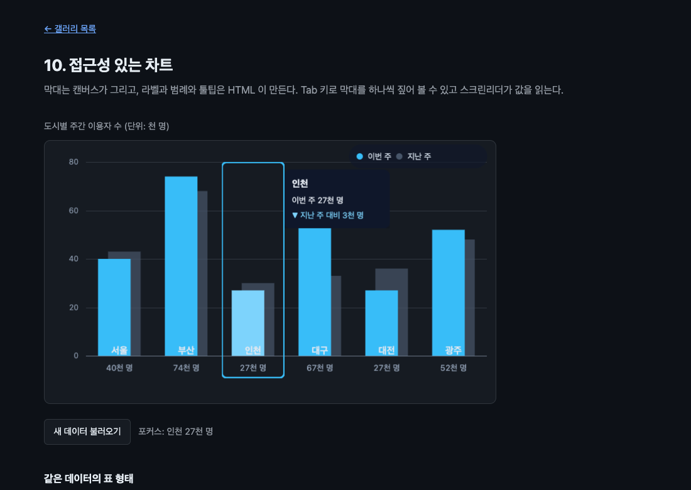

# 10. 접근성 있는 차트

막대는 캔버스가 그리고 라벨과 범례와 툴팁은 HTML 이 만든다. Tab 키로 막대를 하나씩 짚어 볼 수 있고 스크린리더가 값을 읽는다.



## 무엇을 배우나

- 캔버스 드로잉과 `drawElementImage()` 를 한 컨텍스트에서 섞는 법
- 투명한 버튼을 캔버스 자식으로 두어 키보드 포커스와 스크린리더를 얻는 법
- 애니메이션이 필요할 때 `requestPaint()` 를 프레임마다 부르는 구조
- 캔버스 그림과 표 형태 대체 표현을 함께 유지하는 법

## 실행 방법

```bash
mise run serve
mise run chrome
```

`10-accessible-chart/` 로 들어가서 Tab 키를 눌러 보자. 막대에 포커스 테두리가 그려지고 툴팁이 뜬다. VoiceOver 를 켜면(Command + F5) 값을 읽어 준다.

## 핵심 코드

### 1. 무엇을 무엇으로 그릴지 나눈다

기준은 하나다. **그림은 캔버스가, 뜻이 있는 것은 HTML 이 맡는다.**

| 요소 | 그리는 쪽 | 이유 |
| --- | --- | --- |
| 막대, 격자선, 축선 | `ctx.fillRect` / `ctx.stroke` | 도형일 뿐이다. 읽을 것도 누를 것도 없다 |
| y 축 눈금 숫자 | `ctx.fillText` | 짧은 숫자라 레이아웃이 필요 없다 |
| 도시 이름과 값 | `drawElementImage` | 포커스를 받고 스크린리더가 읽어야 한다 |
| 범례 | `drawElementImage` | 점과 글자 배치를 CSS 에 맡기는 편이 쉽다 |
| 툴팁 | `drawElementImage` | 여러 줄 텍스트와 그림자를 직접 그리기는 번거롭다 |

### 2. 투명한 버튼이 요령이다

```css
#chart .column {
  width: 100px;
  height: 344px;
  border: 0;
  /* 배경이 투명해서 그려도 막대를 가리지 않는다. 보이는 것은 글자와 포커스 표시뿐이다. */
  background: transparent;
}

#chart .column:focus-visible {
  outline: 3px solid #38bdf8;
  outline-offset: -2px;
}
```

막대 위에 버튼을 겹쳐 놓되 배경을 투명하게 둔다. 그리면 글자만 나온다. 그런데 포커스가 들어가면 `outline` 이 생기고, 그 outline 은 엘리먼트의 렌더링 결과이므로 **캔버스에도 함께 그려진다.** 포커스 표시를 따로 그릴 필요가 없다.

스크린샷의 파란 테두리가 그것이다. `ctx` 로 그린 것이 아니라 브라우저가 그린 포커스 링이다.

### 3. 순서가 중요하다

```js
ctx.reset();
drawGrid(ctx); // 격자선
drawBars(ctx); // 막대
drawChildren(ctx); // HTML 자식들
```

캔버스는 나중에 그린 것이 위에 온다. 자식을 마지막에 그려야 글자가 막대 위에 얹힌다.

### 4. 위치 동기화는 여기서도 필수

```js
columns.forEach(({ button }, index) => {
  const matrix = ctx.drawElementImage(button, columnX(index), PLOT.top);
  button.style.transform = matrix.toString();
});
```

03 에서 배운 그대로다. 이걸 빼면 Tab 은 되지만 포커스 링이 엉뚱한 곳에 뜨고 마우스가 막대를 못 짚는다.

확인해 봤다.

```text
막대 버튼 수: 6
첫 버튼 aria-label: 서울, 이번 주 88천 명, 지난 주 대비 56천 명 증가
버튼 transform 적용됨: true
세 번째 막대 위 elementFromPoint: value / 버튼 안인가: true
focus 후 activeElement: 두 번째 막대 버튼
상태 표시: 포커스: 부산 78천 명
툴팁 도시: 부산
```

### 5. 애니메이션은 프레임마다 requestPaint

```js
if (progress < 1) {
  requestAnimationFrame(() => chart.requestPaint());
}
```

`drawElementImage()` 는 `paint` 안에서만 부를 수 있으므로 매 프레임 다시 그리려면 매 프레임 `paint` 를 받아야 한다. 07 에서는 텍스처 업로드만 `paint` 에 두고 렌더링은 rAF 로 돌렸는데, 여기서는 자식을 매번 다시 그려야 해서 그 방법을 쓸 수 없다.

정리하면 이렇다.

| 상황                             | 방법                                           |
| -------------------------------- | ---------------------------------------------- |
| 자식이 바뀔 때만 다시 그리면 됨  | 가만히 둔다. `paint` 가 알아서 온다            |
| 그리는 방법만 바뀜 (슬라이더 등) | `requestPaint()` 를 한 번 부른다               |
| 매 프레임 다시 그려야 함         | rAF 안에서 `requestPaint()` 를 반복해서 부른다 |

### 6. 대체 표현을 함께 유지한다

캔버스 아래에 같은 데이터를 담은 `<table>` 이 있다. 캔버스 자식이 접근성 트리에 들어가긴 하지만, 막대 여섯 개를 순서대로 짚는 것과 표를 훑는 것은 다른 경험이다. 값을 비교하거나 정확한 수를 확인할 때는 표가 낫다.

데이터를 바꾸면 세 곳이 함께 갱신된다.

```text
표가 갱신됨: true
캔버스 픽셀 달라짐: true
갱신 후 첫 버튼 aria-label: 서울, 이번 주 33천 명, 지난 주 대비 40천 명 감소
표 첫 행: 서울 / 33천 명 / 73천 명
```

73에서 33으로 40이 줄었다. 캔버스와 버튼 라벨과 표가 같은 숫자를 말한다. 세 곳을 손으로 맞추는 대신 한 데이터에서 세 표현을 만들어 내는 구조여야 어긋나지 않는다.

## 직접 해볼 것

- Tab 키로 막대를 순회해 보자. 포커스 링이 캔버스 안 제자리에 그려진다
- 버튼의 `background: transparent` 를 흰색으로 바꿔 보자. 막대가 가려진다
- `button.style.transform = matrix.toString()` 줄을 지워 보자. 포커스 링이 캔버스 왼쪽 위로 간다
- `drawChildren(ctx)` 를 `drawBars(ctx)` 보다 먼저 불러 보자. 글자가 막대에 덮인다
- VoiceOver 를 켜고 차트를 훑어 보자. 버튼의 `aria-label` 이 읽힌다
- "새 데이터 불러오기" 를 누르고 표와 막대가 같은 값을 말하는지 확인해 보자

## 막히는 지점

| 증상 | 원인 |
| --- | --- |
| Tab 이 막대를 잡지 못한다 | 버튼이 canvas 의 직계 자식이 아니거나 `layoutSubtree` 가 꺼져 있다 |
| 포커스 링이 엉뚱한 곳에 뜬다 | 반환된 행렬을 `transform` 에 넣지 않았다 |
| 글자가 막대에 가려진다 | 그리는 순서가 뒤집혔다 |
| 애니메이션이 첫 프레임에서 멈춘다 | rAF 안에서 `requestPaint()` 를 다시 부르지 않았다 |
| 포커스 링이 안 보인다 | `:focus-visible` 은 키보드로 이동했을 때만 켜진다. 마우스 클릭으로는 안 나온다 |

## 여기까지 왔다면

열 개 예제를 지나오며 이런 것들을 봤다.

- `layoutSubtree` 와 `drawElementImage()` 와 `paint` 이벤트라는 세 축
- 반환된 `DOMMatrix` 를 되먹여 클릭과 접근성을 살리는 패턴
- `changedElements` 로 바뀐 것만 다시 그리기
- 텍스트 레이아웃을 CSS 엔진에 맡길 때 얻는 것
- `toBlob()` 내보내기, WebGL 텍스처, 워커로 넘기는 스냅샷
- 브라우저가 일부러 그리지 않는 것들

아직 표준화 전이고 이름이 한 번 바뀐 API 다. 무언가 이상하면 [API 요약](../../docs/api-reference.md)의 확인 시점을 보고, [WICG 설명서](https://github.com/WICG/html-in-canvas)의 최신 내용과 대조해 보자.

[갤러리 목록으로 돌아가기](../)
