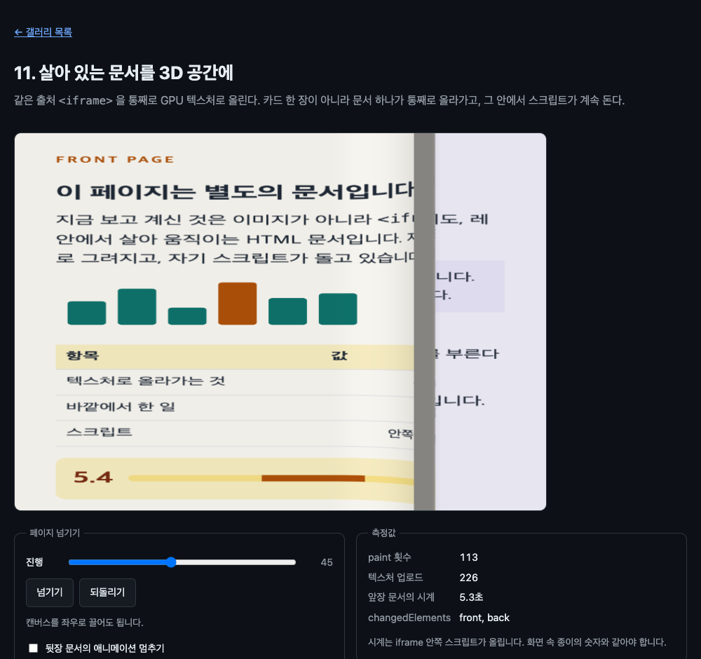

# 11. 살아 있는 문서를 3D 공간에

같은 출처 `<iframe>` 을 통째로 GPU 텍스처로 올린다. 카드 한 장이 아니라 문서 하나가 올라가고, 그 안에서 스크립트가 계속 돈다.



> 이 문서의 측정값은 Chrome 151.0.7922.138 (macOS) 에서 2026-08-22 에 잰 것이다. 표준화 전 API 라 다음 버전에서 달라질 수 있다.

## 무엇을 배우나

- 교차 출처는 빠지지만 **같은 출처 iframe 은 그대로 그려진다**
- iframe 안쪽이 바뀌면 바깥 캔버스의 `paint` 가 저절로 온다. 폴링이 필요 없다
- `changedElements` 가 iframe 단위로 정확히 온다
- 정점 셰이더로 평면을 원기둥에 감아 페이지 넘김 만들기

## 실행 방법

```bash
mise run serve
mise run chrome
```

`11-live-document-3d/` 로 들어가 캔버스를 좌우로 끌어 보자. 종이가 말리는 동안에도 문서 안의 시계가 계속 올라간다.

## 핵심 코드

### 1. iframe 도 그냥 자식이다

```html
<canvas id="stage" width="760" height="540">
  <iframe id="front" src="src/page-front.html" title="앞장 문서" width="360" height="480"></iframe>
  <iframe id="back" src="src/page-back.html" title="뒷장 문서" width="360" height="480"></iframe>
</canvas>
```

01 부터 지켜 온 규칙이 그대로다. canvas 의 직계 자식이면 된다. 그것이 `<div>` 든 `<form>` 든 `<iframe>` 이든 상관없다.

텍스처로 올리는 것도 07 의 카드와 똑같이 부른다.

```js
gl.bindTexture(gl.TEXTURE_2D, texture);
gl.texElementImage2D(gl.TEXTURE_2D, gl.RGBA8, frame, { width: 720, height: 960 });
```

`frame` 이 `<iframe>` 이라는 것만 다르다. 그 안에 있는 별도 문서의 CSS, 표, SVG, 스크립트가 전부 함께 올라간다.

09 에서 본 것과 짝을 이룬다. 교차 출처 iframe 은 통째로 비어 나왔다. 같은 출처는 반대로 통째로 나온다.

### 2. 폴링하지 않는다

이 예제 어디에도 "텍스처를 다시 올려라" 고 시키는 타이머가 없다. 문서 안에서 숫자가 바뀌면 그것이 바깥 `paint` 를 부른다. 따로 재 봤다.

```text
requestPaint 없이 2초: paint 121회, 그림 바뀐 횟수 20
(안쪽 문서의 시계는 100ms 마다 갱신 → 2초에 20번)
```

`paint` 는 프레임마다 오고, 실제로 픽셀이 달라진 것은 20번이다. 안쪽 문서가 바뀐 횟수와 정확히 같다.

### 3. changedElements 가 iframe 단위로 온다

04 에서 배운 것을 여기서 다시 쓴다.

```js
const changed = Array.from(event.changedElements ?? []);
const targets = changed.length > 0 ? changed : [frontFrame, backFrame];
for (const frame of targets) {
  uploadPage(gl, textures.get(frame), frame);
}
```

두 문서 모두 CSS 애니메이션이 돌고 있으면 둘 다 바뀐 것으로 온다. "뒷장 문서의 애니메이션 멈추기" 를 켜면 어떻게 되는지 재 봤다.

```text
둘 다 움직일 때: paint 74회, 업로드 148회 → 프레임당 2.00개
  changedElements: front, back
뒷장 멈춘 뒤:     paint 120회, 업로드 120회 → 프레임당 1.00개
  changedElements: front
  앞장 시계는 계속 도나: 7.7초
```

멈춘 문서는 목록에서 빠지고 업로드가 정확히 절반이 된다. 브라우저가 iframe 안쪽까지 들여다보고 무엇이 바뀌었는지 판단한다는 뜻이다.

토글이 하는 일은 이것뿐이다.

```js
const dot = backFrame.contentDocument?.querySelector('.dot');
if (dot) dot.style.animationPlayState = pauseToggle.checked ? 'paused' : 'running';
```

같은 출처라서 바깥에서 안쪽 DOM 을 만질 수 있다. 교차 출처였다면 `contentDocument` 가 `null` 이다.

### 4. 종이를 원기둥에 감는다

```glsl
float cx = mix(1.0 + RADIUS * PI, -RADIUS * PI, progress);
float d = grid.x - cx;

if (d > 0.0) {
  float theta = d / RADIUS;
  if (theta <= PI) {
    p.x = cx + RADIUS * sin(theta);
    p.z = RADIUS - RADIUS * cos(theta);
    normal = vec3(-sin(theta), 0.0, cos(theta));
  } else {
    p.x = cx - (d - PI * RADIUS);
    p.z = 2.0 * RADIUS;
    normal = vec3(0.0, 0.0, -1.0);
  }
}
```

`cx` 는 말리는 선의 위치다. 오른쪽 밖에서 왼쪽 밖까지 옮기면 한 장이 넘어간다. 그 선보다 오른쪽에 있는 정점만 원기둥에 감긴다. 반 바퀴(`PI`)를 넘으면 뒤로 평평하게 눕는다.

종이를 격자 72×72 로 잘게 나눠 두었다. 정점이 촘촘해야 곡면이 매끄럽다.

### 5. 앞뒤와 그림자

```glsl
if (gl_FrontFacing) {
  rgb = texture(page, uv).rgb;
} else {
  vec3 paper = vec3(0.95, 0.94, 0.91);
  vec3 bleed = texture(page, vec2(1.0 - uv.x, uv.y)).rgb;
  rgb = mix(paper, bleed, 0.07);
}
```

`gl_FrontFacing` 하나로 앞뒤를 가른다. 뒷면은 종이색에 잉크가 7% 비치게 섞었다. 실제 종이도 뒤에서 보면 글자가 옅게 비친다.

아래 장에는 접힌 자리에 그림자를 드리운다. 이것 하나로 종이가 들려 있다는 느낌이 생긴다.

```glsl
float dist = uv.x - curlAt;
shadow = dist > 0.0 ? mix(0.42, 1.0, clamp(dist / 0.2, 0.0, 1.0)) : 1.0;
```

## 직접 해볼 것

- 문서를 넘기는 중에 앞장의 시계를 보자. 말려 있는 동안에도 계속 올라간다
- "뒷장 문서의 애니메이션 멈추기" 를 켜고 업로드 숫자가 절반이 되는 것을 보자
- `src/page-front.html` 을 고쳐 보자. 표를 늘리거나 색을 바꾸면 그대로 종이에 반영된다
- iframe 의 `src` 를 교차 출처 주소로 바꿔 보자. 통째로 비어 나온다
- `RADIUS` 를 0.05 로 줄여 보자. 종이가 얇게 말린다. 셰이더와 JS 두 군데에 있으니 같이 고쳐야 그림자가 어긋나지 않는다
- 격자를 `GRID = 8` 로 줄여 보자. 곡면이 각지게 깨진다

## 막히는 지점

| 증상                           | 원인                                                |
| ------------------------------ | --------------------------------------------------- |
| 종이가 통째로 비어 있다        | iframe 이 교차 출처다. 같은 출처여야 그려진다       |
| 문서가 멈춘 그림처럼 보인다    | 정상일 수 있다. 안쪽이 안 바뀌면 `paint` 도 안 온다 |
| 넘길 때 아래 장이 안 보인다    | 깊이 테스트를 켜지 않았거나 그리는 순서가 뒤집혔다  |
| 뒷면이 안 그려진다             | `gl.disable(gl.CULL_FACE)` 를 빠뜨렸다              |
| `contentDocument` 가 null 이다 | 교차 출처이거나 아직 로드 전이다                    |

## 다음 예제

[12. 캔버스 리치텍스트 에디터](../12-canvas-rich-editor/) — 편집되는 글자에 실시간으로 효과를 입힌다.
