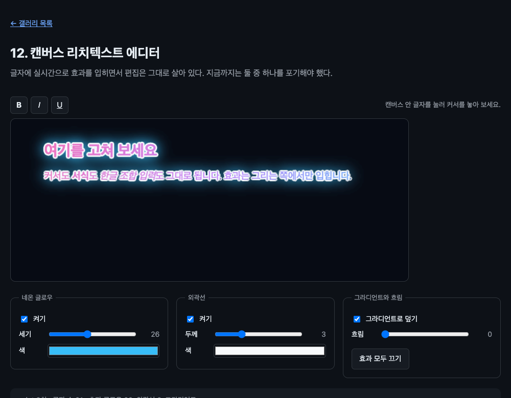

# 12. 캔버스 리치텍스트 에디터

글자에 실시간으로 효과를 입히면서 편집은 그대로 살아 있다. 지금까지는 둘 중 하나를 포기해야 했다.



> 이 문서의 측정값은 Chrome 151.0.7922.138 (macOS) 에서 2026-08-22 에 잰 것이다. 표준화 전 API 라 다음 버전에서 달라질 수 있다.

## 무엇을 배우나

- `contenteditable` 을 canvas 자식으로 두면 편집이 그대로 된다
- **커서가 캔버스에 그려지고 깜빡인다**
- 캔버스 2D 의 상태가 `drawElementImage()` 에 전부 적용된다
- 효과를 겹칠 때 그리는 순서와 합성 모드를 정하는 법

## 실행 방법

```bash
mise run serve
mise run chrome
```

`12-canvas-rich-editor/` 로 들어가 캔버스 안 글자를 눌러 커서를 놓고 타이핑해 보자. 한글도 쳐 보자.

## 핵심 코드

### 1. 편집은 그냥 된다

```html
<canvas id="stage" width="780" height="320">
  <div id="editor" contenteditable="true" spellcheck="false">
    <h2>여기를 고쳐 보세요</h2>
    <p>커서도 <b>서식</b>도 <i>한글 조합 입력</i>도 그대로 됩니다.</p>
  </div>
</canvas>
```

특별한 것이 없다. 03 의 폼 컨트롤과 같은 규칙이다. canvas 의 직계 자식이고, 그린 뒤에 반환된 행렬을 `transform` 에 넣어 주면 클릭과 커서가 제자리를 찾는다.

확인해 봤다.

```text
editor transform 적용됨: true
제목 위 elementFromPoint: H2 / 에디터 안: true
포커스 true · 제목: "여기를 고쳐 보세요 됩니다"
기울임 적용 후 HTML 에 i/em 있나: true
```

캔버스에 그려진 글자 위치에서 히트 테스트가 `<h2>` 를 찾아내고, 그 자리에 커서를 놓고 글자를 넣으면 문서가 바뀐다. 툴바의 기울임 버튼도 먹는다.

### 2. 커서가 캔버스에 그려진다

이게 이 예제에서 가장 중요한 사실이다. 커서가 안 보이면 편집기로 못 쓴다.

커서 위치의 픽셀 밝기를 2.9초 동안 재 봤다.

```text
커서 rect: 306,278 0x36
2.9초 동안 커서 자리 밝기: 최소 12711, 최대 37068
판정: 깜빡이며 그려짐
```

밝기가 오르내린다. 커서가 그려질 뿐 아니라 깜빡이는 주기까지 따라온다. 09 에서 본 read-back-allowed 목록에 "캐럿 깜빡임 주기" 가 **허용** 쪽으로 들어 있는 것과 맞는다. 맞춤법 밑줄은 빼면서 커서는 그리는 이유가 여기 있다. 커서 위치는 사용자가 이미 아는 정보고, 맞춤법 표시는 브라우저만 아는 정보다.

### 3. 캔버스 상태가 전부 먹는다

따로 확인해 봤다.

| 캔버스 상태                           | `drawElementImage()` 에 적용되나 |
| ------------------------------------- | -------------------------------- |
| `ctx.filter`                          | 된다                             |
| `ctx.shadowBlur` / `shadowColor`      | 된다                             |
| `ctx.shadowOffsetX` / `shadowOffsetY` | 된다                             |
| `ctx.globalAlpha`                     | 된다                             |
| `ctx.globalCompositeOperation`        | 된다                             |
| 캔버스 변환 행렬                      | 된다 (02 에서 확인)              |

그래서 특별한 공부가 필요 없다. **"엘리먼트를 그린다" 를 "이미지를 그린다" 와 똑같이 다루면 된다.** 캔버스로 이미지에 하던 것을 살아 있는 DOM 에 그대로 할 수 있다는 뜻이다.

### 4. 그리는 순서가 결과를 가른다

이 예제를 처음 만들었을 때 글자가 뭉개져서 읽을 수 없었다. 글로우와 외곽선을 본문 **위에** 그렸기 때문이다. 순서를 뒤집으니 해결됐다.

```js
// 1. 본문부터
ctx.filter = blur > 0 ? `blur(${blur}px)` : 'none';
const matrix = ctx.drawElementImage(editor, DRAW_X, DRAW_Y);

// 2. 그라디언트로 덮기. 아직 글로우를 그리기 전이라 본문만 물든다.
ctx.globalCompositeOperation = 'source-atop';
ctx.fillStyle = gradient;
ctx.fillRect(0, 0, stage.width, stage.height);

// 3. 여기부터는 뒤로 들어간다
ctx.globalCompositeOperation = 'destination-over';
// 외곽선과 글로우 draw...
```

`destination-over` 는 새로 그리는 것을 이미 있는 것 **뒤** 에 넣는다. 그래서 글로우와 외곽선이 글자를 덮지 않고 테두리로만 보인다.

`source-atop` 을 그라디언트에 쓴 이유도 같다. 이미 그려진 곳에만 얹으므로 글자 모양이 유지된다. 그리고 이 시점에는 본문만 그려져 있으므로 글로우까지 물들지 않는다.

### 5. 외곽선은 그림자를 여덟 번

```js
ctx.shadowColor = controls.outlineColor.value;
ctx.shadowBlur = 0;
for (const [dx, dy] of OUTLINE_DIRECTIONS) {
  ctx.shadowOffsetX = dx * outline;
  ctx.shadowOffsetY = dy * outline;
  ctx.drawElementImage(editor, DRAW_X, DRAW_Y);
}
```

흐림 없는 그림자는 원본과 같은 모양의 단색 실루엣이다. 그것을 여덟 방향으로 조금씩 밀어 겹치면 테두리가 된다. 캔버스에서 글자 외곽선을 만들 때 쓰는 오래된 방법인데, 대상이 글자가 아니라 문서 전체라는 점만 다르다.

## 직접 해볼 것

- 한글을 입력해 보자. 조합 중인 글자가 캔버스에 어떻게 나오는지 본다. 툴바 오른쪽에 조합 상태가 표시된다. 조합 입력은 자동으로 재현할 수 없어 아직 관찰 기록이 없다
- 글자를 드래그해 선택해 보자. 선택 영역이 캔버스에 그려진다
- "효과 모두 끄기" 를 누르고 원본 DOM 과 비교해 보자
- `destination-over` 를 `source-over` 로 바꿔 보자. 앞에서 말한 뭉개진 화면이 그대로 나온다
- 외곽선 두께를 8 로 올려 보자. 글자 사이가 메워진다
- `spellcheck="false"` 를 지우고 오타를 내 보자. 스펙상 맞춤법 표시는 제외 대상이다. 09 에서는 헤드리스라 확인하지 못했으니 여기서 직접 보자

## 막히는 지점

| 증상 | 원인 |
| --- | --- |
| 커서가 엉뚱한 곳에 있다 | 반환된 행렬을 `transform` 에 넣지 않았다 |
| 글자가 뭉개져 읽을 수 없다 | 효과를 본문 위에 그렸다. `destination-over` 로 뒤로 보낸다 |
| 그라디언트가 글로우까지 물들인다 | `source-atop` 을 글로우보다 나중에 불렀다 |
| 툴바를 누르면 커서가 사라진다 | `mousedown` 에서 `preventDefault()` 를 안 했다 |
| 효과를 바꿔도 화면이 그대로다 | 슬라이더는 문서를 바꾸지 않는다. `requestPaint()` 를 직접 부른다 |

## 다음 예제

[13. DOM 을 스텐실로](../13-dom-stencil/) — 레이아웃 전체를 마스크로 쓴다.
