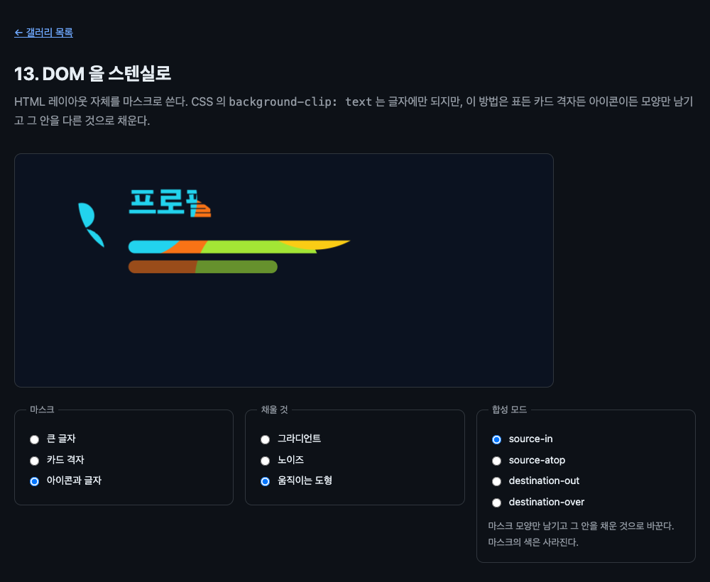

# 13. DOM 을 스텐실로

HTML 레이아웃 자체를 마스크로 쓴다. 아이콘, 글자, 막대가 한 덩어리 스텐실이 되고 그 안을 움직이는 도형으로 채웠다.



## 무엇을 배우나

- 마스크는 색이 아니라 **알파 채널**로 일한다
- `source-in` / `source-atop` / `destination-out` / `destination-over` 가 각각 무엇을 하는지
- 합성 모드를 켠 채로 여러 번 그리면 왜 서로 지우는지, 어떻게 피하는지
- CSS `background-clip: text` 로는 어디까지 되고 어디서 막히는지

## 실행 방법

```bash
mise run serve
mise run chrome
```

`13-dom-stencil/` 로 들어가 마스크와 채울 것과 합성 모드를 바꿔 가며 조합해 보자.

## 핵심 코드

### 1. 마스크를 먼저 그린다

```js
// 1. 마스크를 먼저 그린다. 이 그림의 알파가 곧 스텐실이다.
ctx.drawElementImage(masks.get(maskId), DRAW_X, DRAW_Y);

// 2. 채울 것을 따로 완성한 다음 한 번만 합성한다.
drawFill(fillLayerCtx);
ctx.globalCompositeOperation = mode;
ctx.drawImage(fillLayer, 0, 0);
ctx.globalCompositeOperation = 'source-over';
```

12 에서 캔버스 합성 모드가 `drawElementImage()` 에도 먹는 것을 봤다. 그 성질을 끝까지 밀면 이렇게 된다.

### 2. 마스크는 알파로 일한다

마스크용 엘리먼트는 배경을 비워 둔다.

```css
.mask {
  width: 700px;
  padding: 16px 20px;
  background: transparent;
  color: #000;
}
```

배경이 불투명하면 사각형 전체가 마스크가 되어 아무것도 잘리지 않는다. 채울 것이 그냥 네모로 보인다면 십중팔구 이 문제다.

반투명한 부분은 반투명하게 통과한다. 이 예제의 카드 격자는 넷 중 하나를 `opacity: 0.55` 로 두었는데, 그 카드만 옅게 채워진다.

### 3. 합성 모드를 켠 채로 여러 번 그리면 서로 지운다

처음 만들 때 여기서 막혔다. 움직이는 도형을 골랐더니 마지막 원 하나만 남고 나머지가 사라졌다.

```js
ctx.globalCompositeOperation = 'source-in';
ctx.fillRect(...);   // 배경
ctx.arc(...); ctx.fill();   // 원 1
ctx.arc(...); ctx.fill();   // 원 2 ← 여기서 원 1 이 지워진다
```

`source-in` 은 "겹치는 곳만 남기고 나머지는 지운다" 이다. 원 2 를 그리는 순간 원 2 바깥은 전부 지워진다. 원을 다섯 개 그리면 마지막 원만 남는다.

해결은 간단하다. **채울 그림을 따로 완성한 다음 한 번만 합성한다.**

```js
let fillLayer = new OffscreenCanvas(stage.width, stage.height);
let fillLayerCtx = fillLayer.getContext('2d');
```

합성 모드를 쓸 때 일반적으로 지켜야 하는 규칙이다. 이 API 와 상관없는 캔버스의 원래 성질이다.

### 4. 네 가지 모드

| 모드               | 하는 일                                                                 |
| ------------------ | ----------------------------------------------------------------------- |
| `source-in`        | 마스크 모양만 남기고 그 안을 채운 것으로 바꾼다. 마스크의 색은 사라진다 |
| `source-atop`      | 마스크가 있는 곳에만 채울 것을 덮는다. 반투명한 부분이 비쳐 보인다      |
| `destination-out`  | 채울 것이 지우개가 된다. 겹치는 곳이 뚫린다                             |
| `destination-over` | 채울 것이 마스크 뒤로 들어간다. 마스크가 그대로 보인다                  |

카드 격자 마스크로 실제 픽셀을 재 봤다.

```text
[그라디언트/source-in] 카드 안 226,120,206,255 · 틈 0,0,0,0
[노이즈/source-in]     카드 안 130,97,125,255 · 틈 0,0,0,0
[노이즈/dest-out]      카드 안 0,0,0,0        · 틈 0,0,0,0
[노이즈/dest-over]     카드 안 0,0,0,255      · 틈 156,117,99,255
```

`destination-over` 만 카드 안이 검정(마스크 원본)으로 남고 틈에 노이즈가 들어간다. 나머지는 카드 안쪽에서 일이 일어난다.

### 5. 채울 것에 배경을 칠하지 않는다

움직이는 도형을 만들 때 배경까지 칠했더니 마스크 안이 그 색으로 꽉 차서 도형이 움직여도 티가 나지 않았다. 배경을 빼니 원이 지나갈 때만 색이 보인다.

```text
카드 영역 밝기 합: 1008166 → 959929 → 708988
도형이 마스크 안에서 움직임: true
```

## CSS 로는 어디까지 되나

`background-clip: text` 는 글자 마스크에 한해 잘 된다. 페이지 아래쪽에 나란히 두었다.

```css
.clip-text {
  background: linear-gradient(100deg, #f472b6, #c084fc 50%, #38bdf8);
  background-clip: text;
  color: transparent;
}
```

막히는 곳은 두 군데다.

- **마스크가 될 수 있는 것이 글자뿐이다.** 카드 격자나 아이콘이 섞인 레이아웃은 안 된다
- **채울 것이 배경으로 표현할 수 있는 것에 한정된다.** 캔버스로 그린 노이즈나 매 프레임 움직이는 도형은 배경이 될 수 없다

`mask-image` 를 쓰면 임의의 모양을 마스크로 쓸 수 있지만, 그 모양을 SVG 나 이미지로 **따로 만들어야** 한다. 살아 있는 DOM 을 그대로 마스크로 쓸 수는 없다. 레이아웃이 바뀌면 마스크도 손으로 다시 만들어야 한다.

이 API 는 그 사이를 잇는다. 화면에 이미 있는 레이아웃이 그대로 마스크가 된다.

## 직접 해볼 것

- "아이콘과 글자" 마스크에 "움직이는 도형" 을 채워 보자. CSS 로는 만들 수 없는 조합이다
- 마스크 CSS 에서 `background: transparent` 를 지우고 색을 넣어 보자. 사각형이 통째로 남는다
- 카드 격자에서 네 번째 카드만 옅게 채워지는 것을 보자. `opacity: 0.55` 가 그대로 반영된다
- `destination-out` 으로 글자 모양 구멍을 뚫어 보자
- 오프스크린 레이어를 걷어내고 합성 모드를 켠 채로 원을 여러 개 그려 보자. 마지막 원만 남는다

## 막히는 지점

| 증상 | 원인 |
| --- | --- |
| 마스크가 안 먹고 네모만 보인다 | 마스크 엘리먼트의 배경이 불투명하다 |
| 도형을 여러 개 그렸는데 하나만 남는다 | 합성 모드를 켠 채로 여러 번 그렸다. 따로 완성해서 한 번만 합성한다 |
| 채운 것이 마스크 밖까지 번진다 | `source-atop` 이 아니라 `source-over` 로 그렸다 |
| 화면이 통째로 비었다 | `destination-out` 에서 채울 것이 화면 전체를 덮었다 |

## 다음 예제

[14. HTML 모션그래픽 녹화기](../14-motion-recorder/) — CSS 애니메이션을 영상 파일로 뽑는다.
