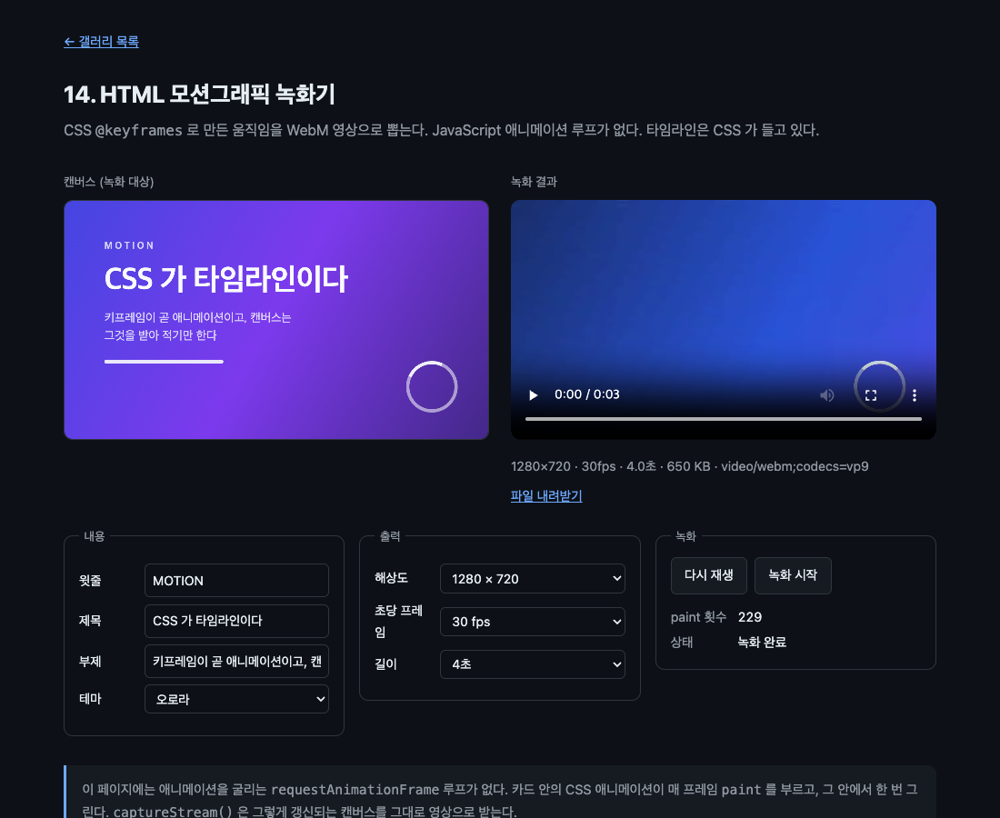

# 14. HTML 모션그래픽 녹화기

CSS `@keyframes` 로 만든 움직임을 WebM 영상으로 뽑는다. JavaScript 애니메이션 루프가 없다.



> 이 문서의 측정값은 Chrome 151.0.7922.138 (macOS) 에서 2026-08-22 에 잰 것이다. 표준화 전 API 라 다음 버전에서 달라질 수 있다.

## 무엇을 배우나

- 그린 엘리먼트 안의 CSS 애니메이션이 렌더링이 바뀔 때마다 `paint` 를 부른다
- `canvas.captureStream(fps)` 와 `MediaRecorder` 로 캔버스를 영상으로
- 코덱을 고르는 법과 해상도를 정하는 법
- 애니메이션을 처음부터 다시 돌리는 오래된 방법

## 실행 방법

```bash
mise run serve
mise run chrome
```

`14-motion-recorder/` 로 들어가 내용을 고치고 "녹화 시작" 을 누른다. 몇 초 뒤 오른쪽에 영상이 나온다.

## 핵심 코드

### 1. 애니메이션 루프가 없다

이 파일 전체를 뒤져도 `requestAnimationFrame` 이 애니메이션을 굴리는 곳이 없다. 움직임은 전부 CSS 다.

```css
#card h2 {
  animation: rise 0.8s cubic-bezier(0.2, 0.8, 0.2, 1) 0.12s both;
}

#card .badge {
  animation: spin 2.4s linear infinite;
}
```

그리는 쪽은 이게 전부다.

```js
stage.addEventListener(
  'paint',
  guardPaint(() => {
    paintCount += 1;
    ctx.reset();
    // 카드는 640×360 이고 캔버스는 출력 해상도다. 그 크기에 맞춰 늘려 그린다.
    ctx.drawElementImage(card, 0, 0, stage.width, stage.height);
    metrics.paints.textContent = String(paintCount);
  }),
);
```

정말 도는지 재 봤다.

```text
JS 애니메이션 루프 없이 2초: paint 43회
캔버스 픽셀 변화: 978916 → 1029633 · 움직임 true
```

CSS 애니메이션이 렌더링을 바꾸고, 그것이 `paint` 를 부르고, 그 안에서 한 번 그린다. **타임라인을 CSS 가 들고 있다.** 위 측정이 2초에 43회인 것은 헤드리스에서 잰 값이라 그렇다. 화면이 있는 창에서는 주사율에 가깝게 온다.

10 에서 정리한 규칙의 세 번째 경우가 필요 없어진 셈이다. 매 프레임 다시 그려야 하는데도 `requestPaint()` 를 반복해서 부를 이유가 없다. 엘리먼트가 스스로 바뀌고 있기 때문이다.

### 2. 캔버스를 영상으로

```js
stream = stage.captureStream(fps);
const recorder = new MediaRecorder(stream, mimeType ? { mimeType } : undefined);
const chunks = [];
recorder.addEventListener('dataavailable', (event) => {
  if (event.data.size > 0) chunks.push(event.data);
});
```

`stream` 을 `try` 블록 밖에 선언해 둔 이유가 있다. 녹화가 끝나거나 중간에 실패하더라도 `finally` 에서 캡처 트랙을 멈춰야 하기 때문이다.

```js
} finally {
  // 캡처 트랙은 멈추기 전까지 캔버스를 계속 붙잡는다. 누를 때마다 쌓이면 안 된다.
  for (const track of stream?.getTracks() ?? []) track.stop();
  recording = false;
  recordButton.disabled = false;
}
```

`captureStream(fps)` 는 캔버스가 갱신될 때마다 프레임을 뽑아 미디어 스트림으로 만든다. 이 API 와 무관한 캔버스의 원래 기능이고, 우리가 한 일은 그 캔버스에 HTML 을 그린 것뿐이다.

코덱은 있는 것 중에서 고른다.

```js
const candidates = ['video/webm;codecs=vp9', 'video/webm;codecs=vp8', 'video/webm'];
return candidates.find((type) => MediaRecorder.isTypeSupported(type)) ?? '';
```

실제 결과다.

```text
1280×720 · 30fps · 4.0초 · 650 KB · video/webm;codecs=vp9
video readyState 4 · 크기 1280x720 · 길이 4.0
```

VP9 로 4초짜리 720p 가 650KB 나왔다. 만들어진 파일을 그 자리에서 `<video>` 로 재생해 확인한다. `readyState 4` 는 끝까지 재생할 수 있다는 뜻이다.

### 3. 애니메이션을 처음부터 다시

녹화를 시작하는 순간과 애니메이션이 시작하는 순간을 맞춰야 첫 프레임부터 담긴다.

```js
function restartAnimations() {
  const animated = card.querySelectorAll('.bg, .eyebrow, h2, .subtitle, .accent, .badge');
  for (const element of animated) element.style.animation = 'none';
  void card.offsetWidth;
  for (const element of animated) element.style.animation = '';
}
```

`void card.offsetWidth` 는 레이아웃을 강제로 다시 계산시키는 오래된 방법이다. 이 줄이 없으면 브라우저가 두 변경을 하나로 합쳐 버려서 애니메이션이 다시 시작하지 않는다.

### 4. 해상도

06 에서 쓴 방법 그대로다. 카드는 640×360 으로 고정하고 캔버스 백킹 스토어만 키운 다음, 5인자 `drawElementImage()` 로 늘려 그린다.

```js
const [width, height] = resolutionSelect.value.split('x').map(Number);
stage.width = width;
stage.height = height;
// width/height 를 바꾸면 컨텍스트가 초기화된다. 다시 그려 달라고 요청한다.
stage.requestPaint();
```

1920×1080 으로 올려도 카드 레이아웃은 그대로다. 글자 크기를 다시 잡을 필요가 없다.

## 이걸로 뭘 할 수 있나

- 자막이나 오프닝을 CSS 로 만들고 영상으로 뽑기
- 데이터가 바뀔 때마다 같은 템플릿으로 영상 자동 생성
- 디자이너가 CSS 로 모션을 잡고 그대로 렌더링

지금까지는 이런 일에 After Effects 같은 도구나 헤드리스 브라우저로 프레임을 한 장씩 찍어 붙이는 파이프라인이 필요했다. 여기서는 브라우저 안에서 끝난다.

## 직접 해볼 것

- 해상도를 1920×1080 으로 올리고 파일 크기를 비교해 보자
- 60fps 로 바꿔 보자. 파일이 커지는 만큼 부드러워지는지 본다
- `@keyframes` 의 시간과 지연을 바꿔 보자. 녹화 결과가 그대로 따라온다
- "다시 재생" 을 누르지 않고 녹화해 보자. 애니메이션 중간부터 담긴다
- `void card.offsetWidth` 를 지우고 "다시 재생" 을 눌러 보자. 아무 일도 일어나지 않는다
- 카드 안에 `<iframe>` 을 넣어 보자. 11 에서 본 것처럼 그것도 함께 녹화된다

## 막히는 지점

| 증상 | 원인 |
| --- | --- |
| 영상이 정지 화면이다 | 캔버스가 갱신되지 않고 있다. `paint` 가 오는지 확인한다 |
| 첫 부분이 잘려 있다 | 녹화 전에 애니메이션을 다시 시작하지 않았다 |
| 애니메이션이 다시 시작되지 않는다 | `void card.offsetWidth` 를 빠뜨렸다 |
| 파일이 0바이트다 | `dataavailable` 에서 조각을 모으지 않았거나 `stop` 을 기다리지 않았다 |
| 해상도를 바꾸면 화면이 빈다 | `canvas.width` 변경 후 다시 그리지 않았다 |
| 재생이 안 된다 | 코덱이 지원되지 않는다. `MediaRecorder.isTypeSupported()` 로 골라야 한다 |

## 여기까지

고급편 네 개를 지나오며 확인한 것들이다.

- 같은 출처 iframe 은 통째로 텍스처가 된다 (11)
- 편집되는 글자에 효과를 입혀도 커서와 입력이 살아 있다 (12)
- 레이아웃 자체를 마스크로 쓸 수 있다 (13)
- CSS 애니메이션이 곧 렌더 루프이고, 그 결과를 영상으로 뽑을 수 있다 (14)

관통하는 것은 하나다. **`drawElementImage()` 는 특별한 그리기가 아니라 그냥 캔버스 그리기다.** 필터, 그림자, 합성 모드, 변환 행렬, `captureStream()` 까지 캔버스가 원래 하던 것이 전부 그대로 먹는다. 달라진 것은 소스가 이미지가 아니라 살아 있는 DOM 이라는 점뿐이다.

[갤러리 목록으로 돌아가기](../)
