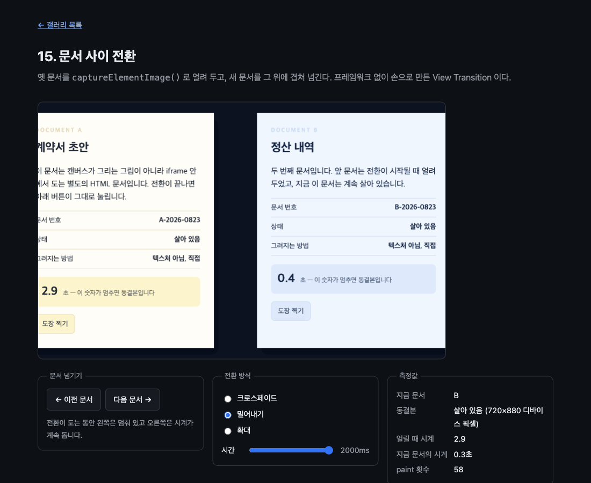

# 15. 문서 사이 전환

옛 문서를 얼려 두고 새 문서를 그 위에 겹쳐 넘긴다. 프레임워크 없이 손으로 만든 View Transition 이다.



> 이 문서의 측정값은 Chrome 151.0.7922.172 (macOS) 에서 2026-08-23 에 잰 것이다. 표준화 전 API 라 다음 버전에서 달라질 수 있다.

## 무엇을 배우나

- `captureElementImage()` 로 뜬 스냅샷은 **원본이 바뀌어도 얼어 있다**
- 얼린 그림과 살아 있는 문서를 한 프레임에 겹쳐 그릴 수 있다
- 그 둘을 섞으면 문서 전환 연출이 된다. 크로스페이드, 밀어내기, 확대
- 다 쓴 스냅샷은 `close()` 로 놓아준다. 놓아준 뒤에는 `width` 가 0 이 된다
- 전환이 끝나면 새 문서는 그냥 문서다. 그려진 자리에서 버튼이 눌린다

## 실행 방법

```bash
mise run serve
mise run chrome
```

브라우저에서 `galleries/15-document-transition/` 을 연다. 플래그를 켜지 않았다면 안내 배너가 뜬다.

## 핵심 코드

### 1. 얼리는 것과 살아 있는 것

`captureElementImage()` 는 `paint` 안에서만 부를 수 있다. 그래서 버튼이 눌리면 바로 얼리지 않고, 눌렸다는 사실만 적어 두었다가 다음 `paint` 에서 처리한다.

```js
function request(direction) {
  if (transition || pending) return; // 도는 중에 또 누르면 무시한다
  pending = { direction };
  stage.requestPaint();
}
```

`paint` 안에서 얼리고, 얼린 다음에 문서를 보낸다. 순서가 반대면 이미 바뀐 문서를 얼리게 된다.

```js
frozen = stage.captureElementImage(frame);
index = (index + direction + PAGES.length) % PAGES.length;
frame.src = `src/page-${PAGES[index]}.html`;
```

### 2. 둘을 구별하지 않고 그린다

이 예제에서 가장 마음에 드는 부분이다. 그리는 쪽은 상대가 얼린 그림인지 살아 있는 문서인지 모른다. `drawElementImage()` 는 둘 다 받는다.

```js
const matrix = context.drawElementImage(target, x, y, width, height);
```

`target` 이 `<iframe>` 이면 지금 이 순간의 문서가 그려지고, `ElementImage` 면 얼렸을 때의 문서가 그려진다. 부르는 방법은 같다.

살아 있는 쪽만 반환 행렬을 되먹인다. 그래야 그림이 있는 자리에서 클릭이 잡힌다. 03 에서 배운 것이다.

```js
if (isLive) frame.style.transform = matrix.toString();
```

### 3. 전환 세 가지

같은 재료로 연출만 바꾼다. 크로스페이드는 자리를 두고 투명도만 교차한다.

```js
function drawFade(t) {
  drawPage(frozen, FRAME_X, FRAME_Y, FRAME_W, FRAME_H, 1 - t, false);
  drawPage(frame, FRAME_X, FRAME_Y, FRAME_W, FRAME_H, t, true);
}
```

밀어내기는 투명도를 건드리지 않고 x 만 옮긴다. 스크린샷이 이 모드다.

```js
function drawPush(t) {
  const shift = (FRAME_W + 80) * transition.direction;
  drawPage(frozen, FRAME_X - shift * t, FRAME_Y, FRAME_W, FRAME_H, 1, false);
  drawPage(frame, FRAME_X + shift * (1 - t), FRAME_Y, FRAME_W, FRAME_H, 1, true);
}
```

확대는 5인자 오버로드로 그리는 크기를 바꾼다. 02 에서 배운 그 오버로드다.

```js
function drawZoom(t) {
  drawScaled(frozen, 1 + 0.2 * t, 1 - t, false);
  drawScaled(frame, 0.86 + 0.14 * t, t, true);
}
```

### 4. 얼어 있다는 증거

스크린샷의 두 시계가 그것이다. 두 문서 모두 100ms 마다 자기 시계를 올린다. 전환이 도는 동안 잰 값이다.

```text
얼릴 때 시계     2.9
지금 문서의 시계 0.4초
동결본           살아 있음 (720×880 디바이스 픽셀)
```

왼쪽 종이의 2.9 는 얼린 순간의 숫자에서 멈춰 있고, 오른쪽 종이는 계속 오른다. 같은 화면에 멈춘 문서와 도는 문서가 함께 있다.

스냅샷 크기가 720×880 인 것도 눈여겨보자. 프레임은 360×440 인데 두 배다. `ElementImage` 는 디바이스 픽셀로 뜬다. 이 화면의 `devicePixelRatio` 가 2 다.

### 5. 다 쓰면 놓아준다

```js
frozen.close();
metrics.frozen.textContent = `닫힘 (width ${frozen.width})`;
frozen = null;
```

`close()` 뒤에 재 보면 `width` 가 0 이다. 그 상태로 다시 그리려 하면 이렇게 막힌다.

```text
InvalidStateError: Failed to execute 'drawElementImage' on
'CanvasRenderingContext2D': The ElementImage has been closed.
```

08 에서 워커로 넘긴 스냅샷을 닫아 준 것과 같은 이유다. 안 닫으면 그림 한 장이 계속 메모리에 남는다.

### 6. 전환이 끝나면 그냥 문서다

전환 뒤에 캔버스에 그려진 "도장 찍기" 버튼 자리를 실제로 클릭해 봤다.

```text
버튼이 화면에서 잡힌 자리: 283, 608
그 자리의 elementFromPoint: IFRAME#frame
도장 결과: 도장 1번 찍힘 — 캔버스 위에서 눌렀습니다
```

캔버스가 그린 그림 위를 눌렀는데 안쪽 문서의 버튼이 반응한다. 반환 행렬을 `transform` 에 되먹였기 때문이다.

## 직접 해볼 것

- 전환 시간을 2000ms 로 올리고 두 시계를 나란히 보자. 왼쪽은 멈춰 있고 오른쪽만 오른다
- 전환 방식을 바꿔 가며 넘겨 보자. 같은 두 장으로 연출만 달라진다
- 전환이 끝난 뒤 "도장 찍기" 를 눌러 보자. 캔버스 위인데 눌린다
- `finish()` 의 `frozen.close()` 를 지워 보자. 화면은 그대로지만 스냅샷이 계속 쌓인다
- `freezeAndGo()` 에서 `captureElementImage` 와 `frame.src` 의 순서를 바꿔 보자. 얼린 것이 새 문서가 되어 전환이 보이지 않는다

## 막히는 지점

| 증상                              | 원인                                                     |
| --------------------------------- | -------------------------------------------------------- |
| 문서가 통째로 비어 있다           | 자식 문서에 스크롤이 생겼다. `scrolling="no"` 를 보라    |
| `InvalidStateError` 가 난다       | `paint` 밖에서 `captureElementImage()` 를 불렀다         |
| 전환 첫 프레임이 빈 종이다        | 새 문서의 `load` 를 기다리지 않고 그리기 시작했다        |
| 전환은 도는데 옛 문서가 안 보인다 | 얼리기 전에 `src` 를 바꿨다. 순서가 중요하다             |
| 그림 위에서 클릭이 안 먹는다      | 반환 행렬을 `style.transform` 에 되먹이지 않았다         |
| 넘긴 뒤 시계가 0 부터 시작한다    | 정상이다. 새 문서라서 그 문서의 스크립트가 새로 시작한다 |

## 다음 예제

[16. 중첩의 한계](../16-nesting-limits/) — 무엇이 몇 겹까지 중첩되고 무엇이 안 되는지 재 본다.
