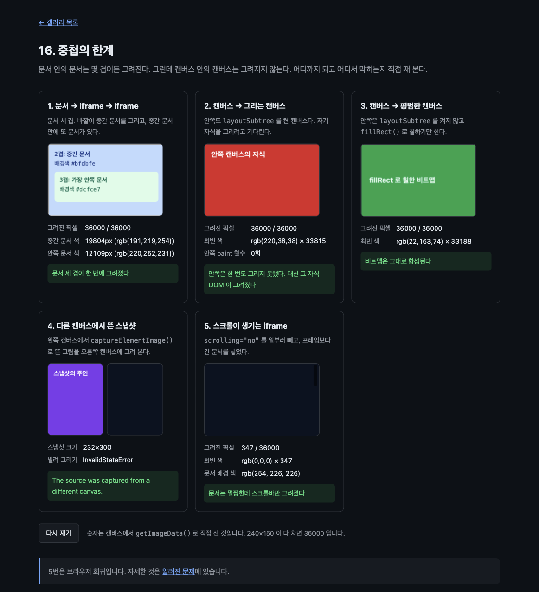

# 16. 중첩의 한계

문서 안의 문서는 몇 겹이든 그려진다. 그런데 캔버스 안의 캔버스는 그려지지 않는다. 어디까지 되고 어디서 막히는지 다섯 칸으로 재 본다.



> 이 문서의 측정값은 Chrome 151.0.7922.172 (macOS) 에서 2026-08-23 에 잰 것이다. 표준화 전 API 라 다음 버전에서 달라질 수 있다.

09 와 성격이 같은 "여기까지" 문서다. 다만 09 는 보안 때문에 막히는 것을 다뤘고, 여기서는 구조 때문에 막히는 것을 다룬다.

## 무엇을 배우나

- 문서 중첩(iframe 안의 iframe)은 몇 겹이든 그려진다
- 캔버스 자식으로 놓인 캔버스는 `paint` 를 **한 번도 받지 못한다**
- 그런데 그 캔버스의 자식 DOM 은 바깥이 대신 그려 준다. 이 비대칭이 요점이다
- 그림만 그리는 평범한 캔버스는 비트맵이 그대로 합성된다
- `ElementImage` 는 자기를 뜬 캔버스에만 그릴 수 있다

## 실행 방법

```bash
mise run serve
mise run chrome
```

브라우저에서 `galleries/16-nesting-limits/` 를 연다. 숫자는 열 때마다 다시 잰다. "다시 재기" 를 눌러도 된다.

## 잰 결과

240×150 캔버스라 다 차면 36000 이다.

| 칸  | 무엇을                 | 그려진 픽셀 | 결과                                      |
| --- | ---------------------- | ----------- | ----------------------------------------- |
| 1   | 문서 → iframe → iframe | 36000       | 세 겹 모두 그려진다                       |
| 2   | 캔버스 → 그리는 캔버스 | 36000       | 안쪽 `paint` 0회. 그 자식 DOM 이 그려진다 |
| 3   | 캔버스 → 평범한 캔버스 | 36000       | 비트맵이 그대로 합성된다                  |
| 4   | 다른 캔버스의 스냅샷   | —           | `InvalidStateError`                       |
| 5   | 스크롤이 생기는 iframe | 347         | 스크롤바만                                |

## 핵심 코드

### 1. 문서는 몇 겹이든 온다

바깥이 그리는 것은 중간 문서 하나뿐이다.

```js
ctx.drawElementImage(el('doc-middle'), 0, 0);
```

그런데 그 안에 또 문서가 있다. 색으로 갈라 세어 보면 둘 다 나온다.

```text
중간 문서 색  19804px (rgb(191,219,254))
안쪽 문서 색  12109px (rgb(220,252,231))
```

중간 문서의 배경과 가장 안쪽 문서의 배경이 동시에 잡힌다. 문서 세 겹이 한 번에 그려졌다는 뜻이다. 더 깊이 넣어도 같다.

### 2. 안쪽 캔버스는 자기 차례를 받지 못한다

안쪽 캔버스도 바깥과 똑같이 준비했다. `layoutSubtree` 를 켜고, `paint` 를 듣고, `requestPaint()` 까지 부른다.

```js
inner.layoutSubtree = true;
inner.addEventListener(
  'paint',
  guardPaint(() => {
    innerPaints += 1;
    inner.getContext('2d').drawElementImage(inner.firstElementChild, 0, 0);
  }),
);
inner.requestPaint(); // 불러도 오지 않는다. 그것이 이 칸의 결론이다.
```

`innerPaints` 는 계속 0 이다. 이유는 단순하다. **캔버스의 자식은 페이지에 렌더링되지 않는다.** 렌더링되지 않는 요소에는 `paint` 가 올 이유가 없다. 그래서 안쪽 캔버스는 영원히 자기 그림을 그리지 못한다.

여기서 비대칭이 나온다. 안쪽 캔버스는 아무것도 그리지 못했는데, 바깥 캔버스가 그 자리를 그릴 때는 **안쪽 캔버스의 자식 DOM 이 그려진다.**

```text
그려진 픽셀     36000 / 36000
최빈 색         rgb(220,38,38) × 33815
안쪽 paint 횟수  0회
```

빨강은 안쪽 캔버스 안에 넣어 둔 `<div>` 의 배경색이다. 화면에서는 볼 수 없는 그 자식이, 바깥이 래스터화할 때는 그려진다.

### 3. 평범한 캔버스는 비트맵이 그대로 온다

`layoutSubtree` 를 켜지 않고 그냥 그림만 그리는 캔버스는 아무 문제가 없다.

```js
innerCtx.fillStyle = '#16a34a';
innerCtx.fillRect(0, 0, inner.width, inner.height);
```

```text
최빈 색  rgb(22,163,74) × 33188
```

`` 나 `<video>` 를 그리는 것과 다르지 않다. 중첩이 막히는 것은 "그리는 캔버스" 지 캔버스 자체가 아니다.

### 4. 스냅샷은 자기 캔버스 밖으로 나가지 못한다

08 에서 만난 제약을 여기서 다시 확인한다.

```js
const image = owner.captureElementImage(el('chip'));
borrowerCtx.drawElementImage(image, 0, 0);
```

```text
InvalidStateError: The source was captured from a different canvas.
```

08 에서 워커로 넘길 때 "제어권을 넘길 캔버스와 자식을 담은 캔버스가 같아야 한다" 고 했던 이유가 이것이다. 스냅샷은 뜬 캔버스에 매여 있다.

### 5. 스크롤이 생기면 문서가 통째로 빠진다

이 칸은 브라우저 회귀다. `scrolling="no"` 를 일부러 빼고 프레임보다 긴 문서를 넣었다.

```text
그려진 픽셀   347 / 36000
최빈 색       rgb(0,0,0) × 347
문서 배경 색  rgb(254, 226, 226)
```

문서에는 분명 배경색이 칠해져 있다. 같은 출처라서 바깥에서 `getComputedStyle` 로 직접 읽어 확인했다. 그런데 그려진 것은 347픽셀, 오버레이 스크롤바뿐이다.

측정값과 우회 방법은 [알려진 문제](../../docs/known-issues.md)에 있다. 11 번은 이것 때문에 검은 화면이 됐었다.

## 따로 재 본 것

"안쪽 캔버스에 비트맵도 있고 자식도 있으면 무엇이 그려지나" 가 궁금해서 따로 재 봤다. 240×120 기준이다.

| 안쪽 캔버스        | `layoutSubtree` | 비트맵 | 바깥이 그린 것        |
| ------------------ | --------------- | ------ | --------------------- |
| 평범한 캔버스      | 안 켬           | 초록   | 초록 비트맵 28800px   |
| 그리는 캔버스      | 켬              | 없음   | 자식 DOM 빨강 28436px |
| 그리는 캔버스      | 켬              | 파랑   | 자식 DOM 빨강 28445px |
| 자식만 있는 캔버스 | 안 켬           | 없음   | 아무것도 0px          |

세 번째 줄이 눈에 띈다. 비트맵이 파랗게 칠해져 있는데도 바깥은 자식 DOM 을 그렸다. `layoutSubtree` 를 켠 순간 그 캔버스의 자식이 "그릴 것" 이 되고, 비트맵은 밀려난다.

화면에서는 정반대다. 페이지에 놓인 캔버스는 언제나 비트맵을 보여 주고 자식은 보이지 않는다. 같은 요소가 어디에 그려지느냐에 따라 다르게 행동한다.

## 직접 해볼 것

- 1번의 `src/page-middle.html` 안에 iframe 을 한 겹 더 넣어 보자. 네 겹도 그려진다
- 2번의 `inner.requestPaint()` 앞에 `console.log` 를 넣어 보자. 불리기는 하는데 `paint` 는 오지 않는다
- 2번의 안쪽 캔버스에서 `layoutSubtree = true` 를 지워 보자. 자식이 레이아웃에서 빠져 아무것도 그려지지 않는다
- 5번의 iframe 에 `scrolling="no"` 를 붙여 보자. 그 순간 문서가 통째로 나타난다
- 4번에서 `owner.captureElementImage` 를 `borrower.captureElementImage` 로 바꿔 보자. 이번엔 반대쪽이 막힌다

## 막히는 지점

| 증상 | 원인 |
| --- | --- |
| 안쪽 캔버스가 아무리 해도 안 그려진다 | 그것이 정상이다. 캔버스 자식은 렌더링되지 않으므로 `paint` 가 없다 |
| 안쪽 캔버스 자리에 엉뚱한 것이 그려진다 | 그 캔버스의 자식 DOM 이다. 폴백 콘텐츠를 넣어 뒀는지 보라 |
| 다른 캔버스에 스냅샷을 못 그린다 | 스냅샷은 뜬 캔버스에 매여 있다. 08 과 같은 제약이다 |
| 중첩한 문서가 통째로 비었다 | 스크롤이 생겼거나 교차 출처다 |

## 다음 예제

[17. 캔버스 위의 미니 브라우저](../17-canvas-browser/) — 그려진 문서 안에서 링크를 누르고, 히트 테스트가 어디까지 정확한지 찾는다.
