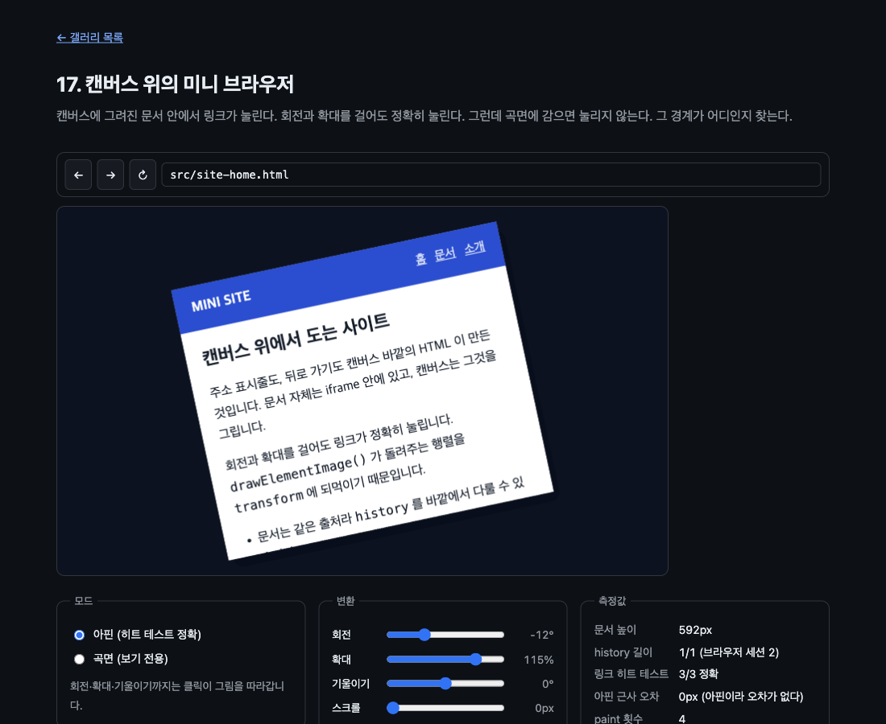

# 17. 캔버스 위의 미니 브라우저

캔버스에 그려진 문서 안에서 링크가 눌린다. 회전과 확대를 걸어도 정확히 눌린다. 그런데 곡면에 감으면 눌리지 않는다. 이 예제의 내용은 그 경계가 어디이고 왜 거기인지다.



> 이 문서의 측정값은 Chrome 151.0.7922.172 (macOS) 에서 2026-08-23 에 잰 것이다. 표준화 전 API 라 다음 버전에서 달라질 수 있다.

## 무엇을 배우나

- 히트 테스트를 정확히 맞출 수 있는 것은 **아핀 변환까지**다
- 반환 행렬을 그대로 쓰려면 `transform-origin: 0 0` 이 필요하다
- 9인자 오버로드로 문서의 일부만 창처럼 보여 줄 수 있다. 스크롤을 캔버스가 대신한다
- iframe 의 세션 히스토리는 부모와 묶여 있다. 브라우저처럼 굴리려면 자기 스택이 필요하다
- 곡면은 왜 안 되는지, 억지로 맞추면 얼마나 어긋나는지

## 실행 방법

```bash
mise run serve
mise run chrome
```

브라우저에서 `galleries/17-canvas-browser/` 를 연다. 문서 안의 링크를 캔버스 위에서 눌러 보면 된다.

## 핵심 코드

### 1. transform-origin 이 없으면 어긋난다

01 부터 써 온 그 한 줄이다.

```js
frame.style.transform = matrix.toString();
```

그런데 회전이나 확대가 들어가면 이것만으로는 부족하다. CSS `transform` 은 기본적으로 **요소 한가운데를 축으로** 걸린다. 반환 행렬은 왼쪽 위를 기준으로 만들어진 것이라 축이 다르면 그림과 클릭 자리가 어긋난다.

```css
#stage iframe {
  transform-origin: 0 0;
}
```

01~14 에서는 그리는 자리를 옮기기만 했다. 이동만 있는 행렬은 축을 어디로 잡든 결과가 같아서 이 문제가 드러나지 않았다. 회전을 넣는 순간 드러난다.

실제로 확인한 값이다. 회전 -12°, 확대 115% 를 걸고 문서 속 링크의 한가운데를 화면 좌표로 옮겨 눌러 봤다.

```text
transform-origin 없음: 링크 자리 (644, 309) → CANVAS#stage   (문서가 아니라 캔버스가 잡힌다)
transform-origin: 0 0: 링크 자리 (552, 316) → IFRAME#frame   (누르면 실제로 이동한다)
```

### 2. 문서 좌표를 화면 좌표로

행렬이 있으면 문서 안의 어떤 점이 화면 어디에 있는지 계산할 수 있다. 캔버스를 CSS 로 줄여 놨을 수 있으니 그 비율까지 곱해야 한다.

```js
const onCanvas = lastMatrix.transformPoint(new DOMPoint(inDocument.x, inDocument.y));
const point = canvasToScreen(onCanvas);
```

```js
function canvasToScreen(point) {
  const box = stage.getBoundingClientRect();
  return {
    x: box.left + point.x * (box.width / stage.width),
    y: box.top + point.y * (box.height / stage.height),
  };
}
```

"링크 위치 확인" 버튼은 이 계산으로 구한 자리에서 `elementFromPoint` 를 부르고, 다시 역행렬로 문서 좌표로 되돌려 그 자리에 정말 그 링크가 있는지 본다. 왕복이 맞아야 1점이다.

### 3. 스크롤은 캔버스가 한다

프레임보다 문서가 길면 스크롤이 생기고, 스크롤이 생긴 iframe 은 지금 Chrome 에서 캔버스에 그려지지 않는다([알려진 문제](../../docs/known-issues.md)). 그래서 프레임을 문서 높이만큼 키워 두고, 보여 줄 창은 캔버스가 잘라 낸다.

```js
frame.height = String(VIEW_H);
docHeight = Math.max(VIEW_H, doc.documentElement.scrollHeight);
frame.height = String(docHeight);
```

먼저 창 높이로 되돌리고 재는 것이 중요하다. 프레임이 크면 `scrollHeight` 가 프레임 크기까지 부풀어서 문서가 실제로 얼마나 긴지 알 수 없다.

그리는 쪽은 02 에서 배운 9인자 오버로드다.

```js
const matrix = ctx.drawElementImage(frame, 0, scrollY, VIEW_W, VIEW_H, 0, 0, VIEW_W, VIEW_H);
```

잘라 낸 위치도 반환 행렬에 들어간다. `scrollY` 를 200 으로 두면 행렬은 `matrix(1, 0, 0, 1, 100, -200)` 처럼 나온다. 스크롤을 내려도 링크가 제자리에서 눌리는 이유다.

### 4. iframe 의 히스토리는 부모와 묶여 있다

처음에는 같은 출처니까 이렇게 하면 되는 줄 알았다.

```js
frame.contentWindow.history.back();
```

이렇게 하면 iframe 이 아니라 **페이지 전체가 뒤로 간다.** iframe 의 세션 히스토리는 부모 문서의 히스토리와 하나로 묶여 있어서, 직전 항목이 부모의 것이면 그쪽이 뒤로 간다.

그래서 이 브라우저는 자기 스택을 든다. 링크는 같은 출처라서 안쪽 문서에 리스너를 달아 가로챈다.

```js
function interceptLinks(doc) {
  doc.addEventListener('click', (event) => {
    const link = event.target.closest?.('a[href]');
    if (!link) return;
    event.preventDefault();
    visit(link.getAttribute('href'));
  });
}
```

이동은 `replace()` 로 한다. 부모의 세션 히스토리를 늘리지 않기 위해서다.

```js
function go(url) {
  frame.contentWindow.location.replace(new URL(url, document.baseURI).href);
}
```

측정값의 "history 길이" 가 그것을 보여 준다. 페이지를 세 번 오가도 브라우저 세션 히스토리는 2 에서 그대로다.

```text
처음        1/1 (브라우저 세션 2)
링크 클릭 뒤 2/2 (브라우저 세션 2)
뒤로 간 뒤   1/2 (브라우저 세션 2)
```

### 5. 곡면은 왜 안 되나

곡면 모드는 문서를 세로로 120조각 내어 조각마다 다른 자리, 다른 크기로 그린다.

```js
ctx.drawElementImage(
  frame,
  i * sliceWidth,
  scrollY,
  sliceWidth,
  VIEW_H,
  left.x,
  left.y,
  width + 0.6,
  height,
);
```

조각 하나하나는 아핀이다. 그런데 전체로는 아니다. **CSS `transform` 에 넣을 수 있는 것은 행렬 하나**이고, 행렬 하나는 아핀 변환 하나만 표현한다. 조각마다 다른 변환을 요소 하나에 걸 방법이 없다.

그러면 "가장 가까운 아핀" 으로 흉내 내면 되지 않을까. 얼마나 어긋나는지 재 봤다. 세 귀퉁이(왼위, 오른위, 왼아래)를 정확히 맞추는 아핀을 만들고, 문서 위 121개 점에서 실제 자리와 비교했다.

```text
아핀 근사 오차: 최대 9.1px (가로 70%, 세로 0% 지점)
```

9픽셀이면 링크 하나가 통째로 밀리는 거리다. 그래서 이 예제는 곡면 모드에서 히트 테스트를 아예 뺀다.

```js
lastMatrix = null;
frame.style.transform = 'none';
frame.style.pointerEvents = 'none';
```

`pointerEvents = 'none'` 이 중요하다. `transform` 만 지우면 프레임이 캔버스 왼쪽 위에 그대로 남아서, 엉뚱한 자리에서 클릭을 가로챈다. 10 에서 배운 것과 같다. 맞출 수 없는 요소는 히트 테스트에서 빼야 한다.

## 직접 해볼 것

- 회전과 기울이기를 끝까지 밀고 "링크 위치 확인" 을 눌러 보자. 계속 3/3 이다
- `src/style.css` 에서 `transform-origin: 0 0` 을 지우고 회전을 걸어 보자. 클릭이 그림에서 벗어난다
- 스크롤을 내리고 링크를 눌러 보자. 잘라 그려도 자리가 맞는다
- 곡면 모드에서 링크를 눌러 보자. 아무 일도 일어나지 않는다. 그것이 의도한 동작이다
- `SPREAD` 를 0.2 로 줄여 보자. 아핀 근사 오차가 함께 줄어든다. 덜 휠수록 아핀에 가까워진다

## 막히는 지점

| 증상                                  | 원인                                                  |
| ------------------------------------- | ----------------------------------------------------- |
| 회전하면 클릭이 어긋난다              | `transform-origin: 0 0` 이 빠졌다                     |
| 뒤로 가기가 페이지 전체를 뒤로 보낸다 | iframe 히스토리는 부모와 묶여 있다. 자기 스택을 써라  |
| 문서가 통째로 안 그려진다             | 문서에 스크롤이 생겼다. 프레임을 문서 높이만큼 키워라 |
| 문서 높이가 줄지 않는다               | 프레임을 키운 채로 쟀다. 창 높이로 되돌린 다음 재라   |
| 곡면 모드에서 엉뚱한 곳이 눌린다      | `pointerEvents = 'none'` 을 빠뜨렸다                  |
| 조각 사이에 실틈이 보인다             | 조각 너비를 조금 겹쳐 그려라 (`width + 0.6`)          |

## 다음 예제

[18. 여러 문서를 한 판에](../18-document-workspace/) — 살아 있는 문서 열두 개를 무한 캔버스에 늘어놓고, 보이는 것만 그린다.
