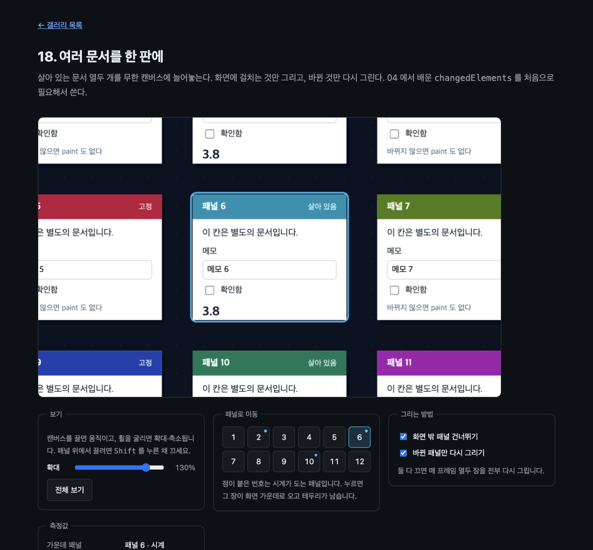

# 18. 여러 문서를 한 판에

살아 있는 문서 열두 개를 무한 캔버스에 늘어놓는다. 화면에 걸치는 것만 그리고, 바뀐 것만 다시 그린다. 04 에서 배운 `changedElements` 를 처음으로 필요해서 쓴다.



> 이 문서의 측정값은 Chrome 151.0.7922.172 (macOS) 에서 2026-08-23 에 잰 것이다. 표준화 전 API 라 다음 버전에서 달라질 수 있다.

## 무엇을 배우나

- 화면에 걸치는 것만 그리는 **뷰포트 컬링**
- `changedElements` 로 **바뀐 것만** 다시 그리기. 캔버스도 그 자리만 지운다
- 안 그린 요소는 히트 테스트에서 빼기 (`transform: none` + `pointer-events: none`)
- 확대가 들어가도 그림 위에서 입력이 잡힌다. `transform-origin: 0 0` 이 필요하다
- 무한 캔버스의 좌표: 월드 좌표 ↔ 화면 좌표
- 히트 테스트를 켜 두면 그 위에서 캔버스를 끌 수 없다. 잠깐 꺼 주는 방법

## 실행 방법

```bash
mise run serve
mise run chrome
```

브라우저에서 `galleries/18-document-workspace/` 를 연다. 번호 버튼을 누르면 그 문서가 화면 가운데로 온다. 캔버스를 끌면 움직이고 휠을 굴리면 확대·축소되며, 패널 위에서 끌 때는 `Shift` 를 누른 채 끈다.

## 잰 결과

패널 열두 장 중 세 장(2, 6, 10)에만 시계를 넣었다.

| 상태                    | 화면에 걸친 패널 | 프레임당 그린 장수 | `changedElements` |
| ----------------------- | ---------------- | ------------------ | ----------------- |
| 전체 보기 (80%)         | 12 / 12          | 1.5장              | 6, 10             |
| 패널 6 확대 (130%)      | 9 / 12           | 2.9장              | 2, 6, 10          |
| 컬링·부분 갱신 둘 다 끔 | 9 / 12           | 12.0장             | 10                |

열두 장을 매 프레임 다시 그리던 것이 두세 장으로 줄었다. 그림은 똑같다.

## 핵심 코드

### 1. 패널은 그냥 자식이다

열두 장 모두 캔버스의 직계 자식으로 넣는다. 문서는 한 파일이고, 무엇이 다른지는 주소의 쿼리로 준다.

```js
frame.src = `src/panel.html?i=${index}&tone=${encodeURIComponent(TONES[index])}&live=${live ? 1 : 0}`;
```

### 2. 화면에 걸치는 것만

월드 좌표를 화면 좌표로 옮기고, 캔버스와 겹치는지만 본다.

```js
function isOnScreen(panel) {
  const box = screenBox(panel);
  return (
    box.x + box.width > 0 && box.y + box.height > 0 && box.x < stage.width && box.y < stage.height
  );
}
```

### 3. 바뀐 것만

`paint` 이벤트가 무엇이 바뀌었는지 알려 준다. 카메라가 그대로라면 그 패널만 다시 그리면 된다.

```js
const partial = partialToggle.checked && !needsFullRedraw && changed.size > 0;
const targets = partial ? candidates.filter((panel) => changed.has(panel.frame)) : candidates;
```

캔버스도 전체를 지우지 않는다. 그 패널 자리만 지우고 바탕을 다시 깐다.

```js
function drawPanel(panel, partial) {
  const box = screenBox(panel);
  if (partial) ground(box.x - 10, box.y - 10, box.width + 32, box.height + 34);
```

바탕을 그리는 함수는 하나다. 전체를 다시 그릴 때는 캔버스 전체를, 부분 갱신일 때는 그 자리만 넘긴다. 같은 코드라서 눈금점이 어긋나지 않는다.

카메라가 움직이면 부분 갱신을 쓸 수 없다. 모든 패널의 자리가 한꺼번에 바뀌기 때문이다.

```js
function moveCamera(changes) {
  Object.assign(camera, changes);
  needsFullRedraw = true;
  stage.requestPaint();
}
```

### 4. 원하는 문서로 가기

번호 버튼은 패널과 함께 스크립트가 만든다. 패널 수를 바꾸면 버튼도 따라 는다.

```js
for (const panel of panels) {
  const button = document.createElement('button');
  button.type = 'button';
  button.textContent = String(panel.index + 1);
  button.className = panel.live ? 'live' : '';
```

누르면 그 패널이 화면 한가운데 오도록 카메라를 옮기고, 어느 것을 골랐는지 테두리로 남긴다.

```js
function focusPanel(panel) {
  const zoom = clampZoom(1.3);
  selected = panel;
  markPicker();

  moveCamera({
    zoom,
    x: panel.x + PANEL_W / 2 - stage.width / 2 / zoom,
    y: panel.y + PANEL_H / 2 - stage.height / 2 / zoom,
  });
```

테두리는 `drawPanel()` 안에서 그린다. 부분 갱신으로 그 패널만 다시 그릴 때도 함께 그려지므로 잔상이 남지 않는다.

지금 화면 가운데에 무엇이 있는지도 함께 보여 준다. 끌거나 확대하면 따라 바뀐다.

```js
const found = panels.find((panel) => {
  const box = screenBox(panel);
  return (
    middle.x >= box.x &&
    middle.x <= box.x + box.width &&
    middle.y >= box.y &&
    middle.y <= box.y + box.height
  );
});
```

```text
패널 9 로 이동 → 가운데 패널: 패널 9,  화면에 걸친 패널 4 / 12
패널 3 로 이동 → 가운데 패널: 패널 3,  화면에 걸친 패널 6 / 12
전체 보기      → 가운데 패널: 패널 없음 (빈자리), 12 / 12
```

### 5. 히트 테스트를 켜 두면 그 위에서 끌 수 없다

패널을 누를 수 있게 만들어 놨으니, 패널 위에서 누른 포인터는 캔버스가 아니라 패널이 가져간다. 그래서 확대해 놓으면 화면이 패널로 덮여 판을 끌 수가 없다.

`Shift` 를 누르고 있는 동안만 자식들을 히트 테스트에서 빼서 해결했다.

```js
const setPanMode = (on) => stage.classList.toggle('pan', on);
window.addEventListener('keydown', (event) => {
  if (event.key === 'Shift') setPanMode(true);
});
```

```css
#stage.pan iframe {
  pointer-events: none !important;
}
```

`!important` 가 필요하다. 그리는 쪽에서 매 프레임 `style.pointerEvents = 'auto'` 를 인라인으로 넣기 때문에, 그냥 규칙으로는 이기지 못한다.

확인한 값이다. 패널 12 를 가운데 놓고 같은 거리만큼 끌어 봤다.

```text
그냥 끌기        가운데 패널: 패널 12 (그대로)
Shift 누르고 끌기 가운데 패널: 패널 11
```

### 6. 안 그린 것은 히트 테스트에서 뺀다

이것을 빠뜨리면 화면 밖 패널이 캔버스 왼쪽 위에 그대로 남아 엉뚱한 자리에서 클릭을 가로챈다. 10 에서 배운 것이 규모가 커지면 반드시 지켜야 하는 규칙이 된다.

```js
const drawn = new Set(candidates);
for (const panel of panels) {
  if (drawn.has(panel)) continue;
  panel.frame.style.transform = 'none';
  panel.frame.style.pointerEvents = 'none';
}
```

확대해서 세 장이 화면 밖으로 나갔을 때 확인한 값이다.

```text
3개가 pointer-events:none, 예: none
```

### 7. 확대해도 눌린다

번호 버튼으로 패널 12 로 간 다음, 그 안의 체크박스를 실제 마우스 이벤트로 눌러 봤다.

```text
패널 12 체크박스 자리: 388, 537 → IFRAME(패널 12)
누르기 전 checked = false
누른 뒤   checked = true
```

확대가 반환 행렬에 들어 있고, 그 행렬을 `transform` 에 되먹였기 때문이다. 다만 축을 왼쪽 위로 고정해야 한다.

```css
#stage iframe {
  transform-origin: 0 0;
}
```

17 에서 확인한 것이다. 이동만 하는 예제에서는 없어도 되지만, 확대나 회전이 들어가면 없으면 어긋난다.

## 직접 해볼 것

- 번호 버튼을 눌러 원하는 문서로 가 보자. 테두리가 남고 "가운데 패널" 이 그 번호가 된다
- 점이 붙은 번호(2, 6, 10)로 가 보자. 그 패널만 시계가 돈다
- 확대한 채로 `Shift` 를 누르고 끌어 보자. 패널 위에서도 판이 움직인다
- "화면 밖 패널 건너뛰기" 를 끄고 확대해 보자. 보이지도 않는 패널을 계속 그린다
- "바뀐 패널만 다시 그리기" 를 꺼 보자. 평균이 12장으로 뛴다
- 판을 끌어 보자. 끄는 동안에는 부분 갱신이 꺼진다. 카메라가 움직이면 모두 다시 그려야 한다
- 확대한 채로 메모 칸에 글을 써 보자. 글자가 바뀌면 그 패널만 다시 그려진다
- `LIVE` 에 번호를 더 넣어 보자. 시계가 도는 패널이 늘수록 프레임당 그리는 장수가 는다

## 막히는 지점

| 증상                          | 원인                                                       |
| ----------------------------- | ---------------------------------------------------------- |
| 화면 밖인데 클릭이 먹힌다     | 컬링한 패널의 `transform`/`pointer-events` 를 안 되돌렸다  |
| 확대하면 클릭이 어긋난다      | `transform-origin: 0 0` 이 빠졌다                          |
| 판을 끌면 잔상이 남는다       | 카메라가 움직였는데 부분 갱신을 그대로 썼다                |
| 눈금점이 패널 둘레에서 끊긴다 | 부분 갱신에서 지운 자리에 바탕을 다시 안 깔았다            |
| 패널 내용이 잘린다            | 문서가 프레임보다 길다. 스크롤이 생기면 통째로 안 그려진다 |

## 다음 예제

[19. 문서를 페이지로 자르기](../19-paginate/) — 긴 문서 하나를 인쇄용 페이지들로 나눈다.
