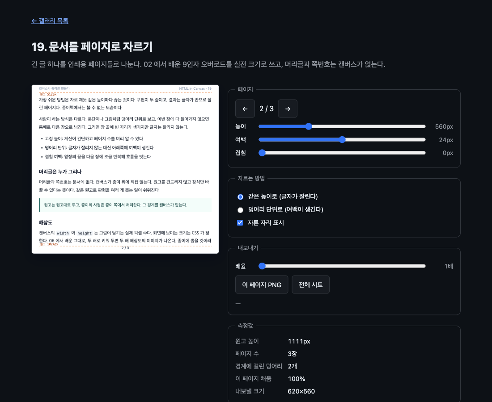

# 19. 문서를 페이지로 자르기

긴 글 하나를 인쇄용 페이지들로 나눈다. 02 에서 배운 9인자 오버로드를 실전 크기로 쓰고, 머리글과 쪽번호는 캔버스가 얹는다.



> 이 문서의 측정값은 Chrome 151.0.7922.172 (macOS) 에서 2026-08-23 에 잰 것이다. 표준화 전 API 라 다음 버전에서 달라질 수 있다.

## 무엇을 배우나

- 같은 요소를 여러 번, 매번 다른 부분만 잘라 그리면 그것이 페이지 나누기다
- 캔버스 크기가 곧 인쇄 해상도다 (06 의 백킹 스토어 이야기)
- 머리글과 쪽번호는 원고에 없다. 종이 쪽에서 얹는다
- 같은 높이로 자르면 글자가 잘리고, 덩어리 단위로 자르면 여백이 남는다
- 내보내기는 **그린 자리에서** 해야 한다. 다음 프레임으로 미루면 빈 캔버스를 뜬다

## 실행 방법

```bash
mise run serve
mise run chrome
```

브라우저에서 `galleries/19-paginate/` 를 연다. 높이와 여백을 바꾸면 페이지 수가 다시 계산된다.

## 잰 결과

원고 높이는 1111px 이고, 페이지 높이 560px · 여백 24px 로 자른 결과다.

| 자르는 방법 | 페이지 수 | 경계에 걸린 덩어리 | 이 페이지 채움 |
| ----------- | --------- | ------------------ | -------------- |
| 같은 높이로 | 3장       | 2개                | 100%           |
| 덩어리 단위 | 3장       | 0개                | 93%            |

같은 장수인데 하나는 글자가 두 군데서 잘리고, 하나는 잘리지 않는 대신 아래에 7% 의 여백이 남는다. 종이에 뽑는다면 후자다.

## 핵심 코드

### 1. 잘라 그리는 한 줄

페이지마다 다른 것은 출처 사각형의 세로 위치뿐이다.

```js
ctx.drawElementImage(article, 0, start, PAGE_W, view, 0, margin, PAGE_W, view);
```

원고는 자기가 잘리는지 모른다. 스크롤도 하지 않고 레이아웃도 바뀌지 않는다. 같은 원고를 세 번 그렸을 뿐이다.

### 2. 어디서 끊을 것인가

같은 높이로 자르는 쪽은 두 줄이다.

```js
const step = Math.max(40, view - overlap);
const starts = [];
for (let y = 0; y < docHeight; y += step) starts.push(y);
```

덩어리 단위는 원고를 이루는 요소들을 보고, 이번 장에 다 들어가지 않으면 통째로 넘긴다.

```js
for (const block of list) {
  const start = starts[starts.length - 1];
  // 이 덩어리가 이번 장에 다 들어가지 않으면 통째로 다음 장으로 넘긴다.
  if (block.bottom - start > view && block.top > start) starts.push(block.top);
}
```

덩어리 목록은 원고의 자식 요소들에서 바로 얻는다. 캔버스의 자식이지만 레이아웃은 정상으로 잡혀 있으므로 `getBoundingClientRect()` 가 그대로 쓸모 있다.

```js
function blocks() {
  const base = article.getBoundingClientRect().top;
  return [...article.children].map((element) => {
    const box = element.getBoundingClientRect();
    return { top: box.top - base, bottom: box.bottom - base };
  });
}
```

### 3. 몇 군데서 잘렸나

경계가 덩어리 한가운데를 지나가면 글자가 잘린다. 세어서 화면에 보여 준다.

```js
let cuts = 0;
for (const start of starts.slice(1)) {
  if (list.some((block) => block.top < start && block.bottom > start)) cuts += 1;
}
```

### 4. 캔버스가 곧 종이다

06 에서 배운 것을 그대로 쓴다. 캔버스의 `width`/`height` 는 그림이 담기는 실제 픽셀 수이고, 보이는 크기는 CSS 가 잡는다.

```js
function resizeCanvas() {
  const pageHeight = Number(inputs.height.value);
  stage.width = PAGE_W * scale();
  stage.height = pageHeight * scale();
  stage.style.aspectRatio = `${PAGE_W} / ${pageHeight}`;
}
```

배율을 2배로 올리면 그대로 2배 해상도의 PNG 가 나온다.

```text
1배: page-2-620x560.png
2배: page-2-1240x1120.png (230 KB)
```

### 5. 내보내기는 그린 자리에서

여기서 한 번 틀렸다. 처음에는 이렇게 썼다.

```js
stage.requestPaint();
requestAnimationFrame(() => stage.toBlob(save));
```

그랬더니 시트 PNG 가 통째로 비어 나왔다. 픽셀을 세어 보니 1908×584 전부가 빈 화면이었다.

```text
{"size":"1908x584","ink":1114272,"white":0}   ← 전부 빈 캔버스
```

`requestPaint()` 가 예약한 `paint` 가 `requestAnimationFrame` 콜백보다 늦게 온다. 크기를 바꾸면 캔버스는 초기화되므로, 그 사이에 뜬 그림은 빈 화면이다.

그리는 곳에서 바로 내보내면 된다.

```js
// 내보내기는 반드시 그린 직후, 이 자리에서 해야 한다.
// requestAnimationFrame 에 미루면 paint 보다 먼저 돌아 빈 캔버스를 뜨게 된다.
if (exporting) writeFile();
```

고친 뒤 같은 방법으로 다시 세었다.

```text
페이지: {"size":"620x560",  "ink":16856, "white":316092}
시트:   {"size":"1908x584", "ink":42866, "white":939718}
```

시트의 잉크가 페이지의 약 세 배다. 페이지 세 장이 실제로 들어갔다는 뜻이다.

## 직접 해볼 것

- 높이를 420 에서 900 까지 밀어 보자. 페이지 수와 잘린 덩어리 수가 함께 바뀐다
- 700px 에서는 잘린 덩어리가 0개다. 경계가 마침 문단 사이에 떨어진다
- 겹침을 40px 로 올려 보자. 앞장의 끝줄이 다음 장 머리에 반복된다
- 덩어리 단위로 바꾸고 채움 비율을 보자. 100% 에서 93% 로 떨어진다
- 배율을 3배로 올리고 저장해 보자. 파일 크기가 그만큼 커진다

## 막히는 지점

| 증상 | 원인 |
| --- | --- |
| 저장한 PNG 가 비어 있다 | `paint` 밖에서 `toBlob()` 을 불렀다. 그린 자리에서 불러야 한다 |
| 크기를 바꿨더니 화면이 하얘졌다 | `width`/`height` 를 바꾸면 컨텍스트가 초기화된다. 다시 그려야 한다 |
| 페이지 수가 안 맞는다 | 여백을 뺀 높이로 계산해야 한다 |
| 글자가 반으로 잘린다 | 같은 높이로 자르는 방식의 특성이다. 덩어리 단위로 바꿔 보라 |
| 마지막 장이 거의 비어 있다 | 덩어리 하나가 통째로 넘어갔다. 겹침이나 높이를 조절하라 |

## 다음 예제

[20. WebGPU 로 요소 텍스처 올리기](../20-webgpu-texture/) — 07 의 WebGL 판을 WebGPU 로 옮긴다.
