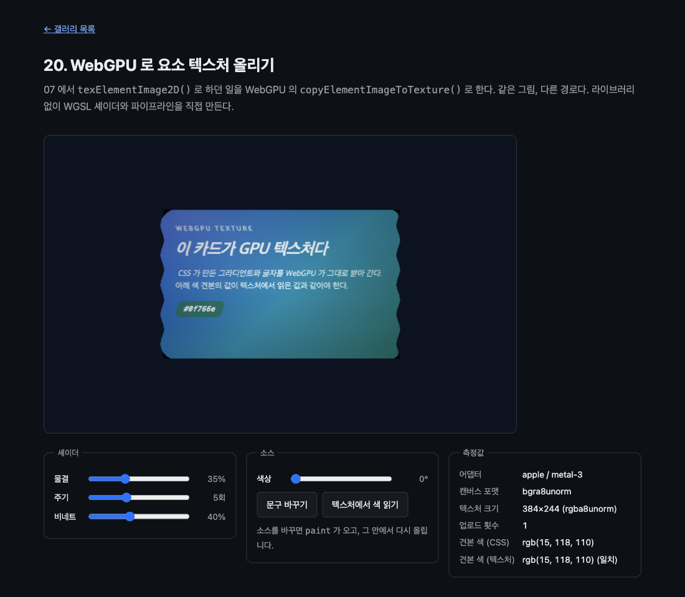

# 20. WebGPU 로 요소 텍스처 올리기

07 에서 `texElementImage2D()` 로 하던 일을 WebGPU 의 `copyElementImageToTexture()` 로 한다. 같은 그림, 다른 경로다. 라이브러리 없이 WGSL 셰이더와 파이프라인을 직접 만든다.



> 이 문서의 측정값은 Chrome 151.0.7922.172 (macOS, Apple/metal-3 어댑터) 에서 2026-08-23 에 잰 것이다. 표준화 전 API 라 다음 버전에서 달라질 수 있다.

## 무엇을 배우나

- `device.queue.copyElementImageToTexture()` 로 요소를 GPU 텍스처에 올리기
- WGSL 셰이더, 렌더 파이프라인, 샘플러, 바인드 그룹을 직접 만들기
- 요소는 **CSS 크기 그대로** 올라간다. 디바이스 픽셀이 아니다
- WebGPU 의 검증 오류는 예외로 오지 않는다. 조용히 빈 텍스처가 된다
- 07 의 WebGL2 경로와 무엇이 같고 무엇이 다른지

## 실행 방법

```bash
mise run serve
mise run chrome
```

브라우저에서 `galleries/20-webgpu-texture/` 를 연다. WebGPU 를 쓸 수 없거나 진입점이 없으면 안내 배너가 뜬다.

## 07 과 나란히

|                | 07 (WebGL2)              | 20 (WebGPU)                                          |
| -------------- | ------------------------ | ---------------------------------------------------- |
| 올리는 함수    | `gl.texElementImage2D()` | `device.queue.copyElementImageToTexture()`           |
| 부르는 자리    | `paint` 안               | `paint` 안 (같다)                                    |
| 셰이더         | GLSL ES 3.0              | WGSL                                                 |
| 준비할 것      | 프로그램, 텍스처         | 파이프라인, 텍스처, 샘플러, 바인드 그룹, 유니폼 버퍼 |
| 올라가는 크기  | 인자로 지정              | 요소의 CSS 크기                                      |
| 잘못 불렀을 때 | `gl.getError()`          | `uncapturederror` 이벤트                             |

## 핵심 코드

### 1. 올리는 한 줄

```js
device.queue.copyElementImageToTexture(
  { source: card },
  { destination: { texture: gpu.texture } },
  [CARD_W, CARD_H],
);
```

두 번째 인자의 모양이 조금 특이하다. `{ texture }` 가 아니라 `{ destination: { texture } }` 다. 처음에 `{ texture }` 로 불렀더니 이렇게 막혔다.

```text
TypeError: Failed to read the 'destination' property from
'GPUCopyElementImageDestination': Required member is undefined.
```

07 과 마찬가지로 `paint` 안에서만 부를 수 있다. 캔버스에 렌더링 컨텍스트가 없어도 막힌다.

```text
copyElementImageToTexture(): containing canvas does not have a rendering context.
```

### 2. 요소는 CSS 크기로 올라간다

여기서 한 번 헤맸다. 15 에서 `captureElementImage()` 가 360×440 프레임을 720×880 으로 뜨는 것을 봤으므로, 여기서도 두 배로 잡았다. 그랬더니 텍스처의 왼쪽 위 구석만 채워졌다.

크기를 재 봤다. 일부러 1×1 텍스처에 복사해서 검증 오류 메시지에 찍히는 크기를 읽는 방법이다.

| 요소                         | CSS 크기 | 실제 복사 크기 |
| ---------------------------- | -------- | -------------- |
| `div`                        | 100×60   | 100×60         |
| `div`                        | 380×240  | 380×240        |
| `div`                        | 301×151  | 301×151        |
| `div` + 3px 테두리           | 106×66   | 106×66         |
| 이 예제의 카드 (둥근 모서리) | 380×240  | 382×242        |

`devicePixelRatio` 는 2 인데도 CSS 크기 그대로다. `captureElementImage()` 와 다르다. 둥근 모서리가 있으면 가장자리가 1px 씩 늘기도 한다.

그래서 텍스처는 조금 넉넉하게 잡고, 셰이더에서는 카드 크기만큼만 읽는다.

```js
const TEXTURE_W = CARD_W + 4;
const TEXTURE_H = CARD_H + 4;
```

```wgsl
// 텍스처는 카드보다 조금 크다. 카드에 해당하는 앞쪽만 읽는다.
let used = vec2f(380.0 / 384.0, 240.0 / 244.0);
```

### 3. 텍스처 사용 용도를 빠뜨리면 조용히 빈다

`RENDER_ATTACHMENT` 를 빼먹었더니 복사가 아무 말 없이 실패했다. 예외도, 콘솔 경고도 없었다. 화면만 까맸다.

```js
usage:
  GPUTextureUsage.TEXTURE_BINDING |
  GPUTextureUsage.COPY_DST |
  GPUTextureUsage.COPY_SRC |
  GPUTextureUsage.RENDER_ATTACHMENT,
```

WebGPU 의 검증 오류는 예외로 오지 않는다. 이것을 달아 두면 원인이 화면에 뜬다.

```js
device.addEventListener('uncapturederror', (event) => {
  metrics.gpu.textContent = `GPU 검증 오류: ${event.error.message.split('\n')[0]}`;
});
```

### 4. WGSL 은 textureSample 을 아무 데서나 못 부른다

처음에는 카드 밖이면 일찍 `return` 하도록 썼다. 컴파일이 이렇게 막혔다.

```text
error line 47: 'textureSample' must only be called from uniform control flow
info  line 41: control flow depends on possibly non-uniform value
```

GLSL 에서는 되던 모양이다. WGSL 에서는 항상 샘플하고, 고르는 일을 뒤로 미뤄야 한다.

```wgsl
let inside = uv.x >= 0.0 && uv.x <= 1.0 && uv.y >= 0.0 && uv.y <= 1.0;
var color = textureSample(cardTexture, textureSampler, clamp(uv, vec2f(0.0), vec2f(1.0)) * used).rgb;
return vec4f(select(background, color, inside), 1.0);
```

컴파일 오류는 예외로 오지 않는다. `module.getCompilationInfo()` 를 부르면 볼 수 있다.

### 5. 올라간 것을 되읽어 확인한다

"제대로 올라갔다" 를 주장하는 대신 텍스처에서 색을 직접 읽는다. 텍스처를 버퍼로 복사하고 CPU 로 매핑한다. `bytesPerRow` 는 256 의 배수여야 하므로 64픽셀 너비만 떠 온다.

```js
encoder.copyTextureToBuffer(
  { texture: gpu.texture, origin: { x, y } },
  { buffer, bytesPerRow: 256, rowsPerImage: 32 },
  [64, 32],
);
```

카드 안의 색 견본은 CSS 로 `#0f766e` 다. 텍스처에서 읽은 값과 맞는다.

```text
견본 색 (CSS)     rgb(15, 118, 110)
견본 색 (텍스처)  rgb(15, 118, 110) (일치)
```

색상 슬라이더로 `hue-rotate` 를 걸면 값이 갈라진다. 이것도 정상이다. 계산된 스타일에는 필터가 반영되지 않고, 텍스처에는 필터까지 적용된 그림이 올라간다.

```text
견본 색 (CSS)     rgb(15, 118, 110)
견본 색 (텍스처)  rgb(148, 73, 158) (색상 필터가 걸려 있어 달라야 맞다)
```

### 6. 소스가 바뀌면 다시 올라간다

07·11 과 같다. 다시 올리라고 시키는 타이머가 없다. 문구를 바꾸거나 색상을 돌리면 `paint` 가 오고, 그 안에서 업로드가 일어난다.

```text
처음        업로드 1회
문구 바꾸기  업로드 2회
색상 돌리기  업로드 3회
```

## 직접 해볼 것

- "문구 바꾸기" 를 누르고 업로드 횟수를 보자. 한 번씩 늘어난다
- 색상을 돌린 뒤 "텍스처에서 색 읽기" 를 눌러 보자. CSS 값과 갈라진다
- `TEXTURE_W` 를 `CARD_W` 로 줄여 보자. 검증 오류가 뜨고 화면이 빈다
- `RENDER_ATTACHMENT` 를 빼 보자. 아무 말 없이 까매진다
- 물결과 비네트를 0 으로 두면 07 과 같은 그림이 된다. 나란히 열어 비교해 보자

## 막히는 지점

| 증상 | 원인 |
| --- | --- |
| `Required member is undefined` | 두 번째 인자는 `{ destination: { texture } }` 다 |
| `containing canvas does not have a rendering context` | `getContext('webgpu')` 를 먼저 불러야 한다 |
| 아무 오류 없이 까맣다 | 텍스처 usage 에 `RENDER_ATTACHMENT` 가 빠졌다 |
| 텍스처 한쪽 구석만 채워진다 | 요소는 CSS 크기로 올라간다. 두 배로 잡지 말 것 |
| `must only be called from uniform control flow` | WGSL 은 조건부 `textureSample` 을 막는다. 항상 샘플하고 고르라 |
| 어디가 틀렸는지 알 수 없다 | `uncapturederror` 와 `getCompilationInfo()` 를 달아라 |

## 여기까지

이것이 마지막 예제다. 처음 열 개로 API 의 기본을 훑고, 11~~14 로 실제로 무엇을 만들 수 있는지 봤고, 15~~20 으로 문서와 문서가 연결된 자리까지 갔다. [갤러리 목록](../)에서 다시 고를 수 있다.
