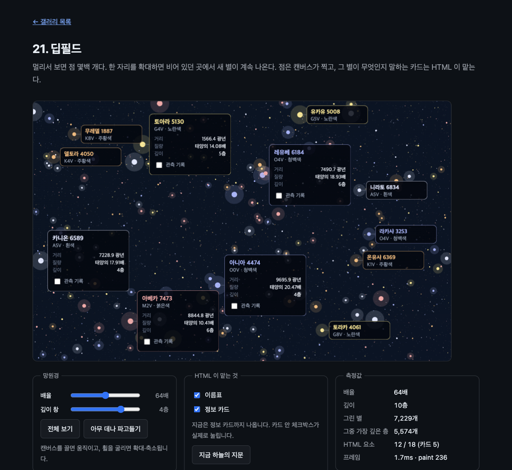

# 21. 딥필드

멀리서 보면 점 몇백 개다. 한 자리를 확대하면 비어 있던 곳에서 새 별이 계속 나온다. 점은 캔버스가 찍고, 그 별이 무엇인지 말하는 카드는 HTML 이 맡는다.



> 이 문서의 측정값은 Chrome 151.0.7922.172 (macOS) 에서 2026-08-24 에 잰 것이다. 표준화 전 API 라 다음 버전에서 달라질 수 있다.

## 무엇을 배우나

- **HTML 요소를 풀에 담아 돌려 쓰기.** 지금까지 예제는 캔버스 자식 수가 고정이었다(18번의 12개가 최대). 보이는 것이 계속 바뀌면 요소를 대상마다 만들 수 없다
- 그리는 일과 DOM 을 고치는 일을 갈라 두기. `paint` 안에서는 그리기만 한다
- 사분트리와 결정론적 시드로 데이터를 그 자리에서 만들기. 미리 만들어 둘 것이 없다
- 수천 개의 점을 색과 밝기로 묶어 한 번에 채우기
- 캔버스 자식에서 올라온 포인터 이벤트를 카메라 조작과 구분하기

## 실행 방법

```bash
mise run serve
mise run chrome
```

브라우저에서 `galleries/21-deep-field/` 를 연다. 캔버스를 끌면 움직이고, 휠을 굴리면 확대·축소된다. 48배부터 이름표가 정보 카드로 바뀐다.

## 잰 결과

### 확대할수록 별이 는다

배율만 올리며 잰 값이다. 카메라는 그대로 두었다.

| 배율   | 깊이 | 그린 별  | 그중 가장 깊은 층 | HTML 요소        | 프레임 |
| ------ | ---- | -------- | ----------------- | ---------------- | ------ |
| 1배    | 4층  | 3,390개  | 2,701개           | 6 / 18           | 1.2ms  |
| 8배    | 7층  | 5,283개  | 4,143개           | 12 / 18          | 1.6ms  |
| 64배   | 10층 | 7,229개  | 5,574개           | 12 / 18 (카드 5) | 1.7ms  |
| 512배  | 13층 | 9,108개  | 6,996개           | 12 / 18 (카드 5) | 1.7ms  |
| 4096배 | 16층 | 11,034개 | 8,440개           | 12 / 18 (카드 5) | 2.2ms  |

배율이 여덟 배 오를 때마다 층이 셋 늘고, 그때마다 그 층의 별이 새로 나타난다. 화면에 그려지는 별은 3천 개에서 1만 1천 개로 늘지만 HTML 요소는 열두 개 그대로다. 그리는 시간도 거의 그대로다.

"밀도" 를 올리면 칸마다 별이 네 배, 열여섯 배로 나온다. 이때부터는 그리기가 버거워진다.

| 밀도 | 그린 별   | 프레임                |
| ---- | --------- | --------------------- |
| ×1   | 7,229개   | 60fps · 그리기 1.3ms  |
| ×4   | 28,860개  | 60fps · 그리기 6.0ms  |
| ×16  | 115,506개 | 17fps · 그리기 23.1ms |

같은 하늘을 WebGL2 로 그리면 이 숫자가 어떻게 달라지는지는 [22번](../22-deep-field-gpu/)에 있다.

### 만들기 전에 재 본 것

풀 크기와 점 수를 숫자로 정하려고 먼저 쟀다. 900×560 캔버스 기준이다.

| 무엇을                                       | 결과                          |
| -------------------------------------------- | ----------------------------- |
| 자식 20 / 200 / 1000개 두고 카드 40장 그리기 | 셋 다 61fps, 핸들러 0.3~0.4ms |
| 자식 200개 · 카드 100장 그리기               | 61fps, 핸들러 0.54ms          |
| 자식만 1000개 두고 그리지 않기               | 61fps, 핸들러 0.02ms          |
| 10,000점 `fillRect` / `arc`                  | 1.22ms / 2.62ms               |
| 50,000점 `fillRect` / `arc`                  | 2.19ms / 4.04ms               |
| 200,000점 `fillRect` / `arc`                 | 31.41ms (33fps) / 16.84ms     |

자식 수는 병목이 아니었다. `drawElementImage` 도 한 장에 1µs 안팎이다. 20만 점부터는 하나씩 `fillRect` 로 찍는 쪽이 무너지는데, **한 경로에 모아 한 번에 채우는 쪽이 두 배 가까이 빨랐다.** 이 예제가 별을 색깔별로 묶어 그리는 이유다.

## 핵심 코드

### 1. 별은 그 자리에서 만든다

별 목록이 없다. 화면에 걸치는 칸마다 그 칸의 좌표로 시드를 만들어 그 자리에서 낸다.

```js
export function starsInCell(depth, cellX, cellY, density = 1) {
  const seed = hash(depth, cellX, cellY);
  const next = random(seed);
```

그래서 같은 자리를 다시 보면 언제나 같은 별이 나온다. 페이지를 새로 열어도 마찬가지다. 지금 보이는 별 id 를 모아 접은 값으로 확인했다.

```text
처음 : 별 7229개 · 지문 550f346a
다시 : 별 7229개 · 지문 550f346a   (페이지를 새로 열고 같은 배율로)
```

깊이가 깊을수록 칸마다 별이 촘촘해진다. 이 한 줄이 "확대하면 새 별이 나온다" 를 만든다.

```js
const STARS_AT = (depth) => 5 + depth * 3;
```

생성기는 [`_shared/starfield.js`](../_shared/starfield.js) 에 있다. 22번이 같은 하늘을 봐야 두 경로를 비교할 수 있어서 따로 뺐다.

### 2. 요소 열여덟 개를 돌려 쓴다

별은 만 개가 넘어도 HTML 요소는 열여덟 개다. 화면에 동시에 띄우는 최대치(카드 5 + 이름표 12)보다 하나 크게 잡았다.

```js
const POOL_SIZE = 18;
```

자리를 나눠 줄 때, 이미 그 별을 맡고 있는 요소는 건드리지 않는다. 별이 화면에서 빠지면 그 자리를 회수해 새 별에 준다.

```js
  const free = pool.filter((slot) => !keep.has(slot));
  for (const entry of wanted) {
    if (assigned.has(entry.star.id)) continue;
    const slot = free.pop();
    if (!slot) break;
    if (slot.star) assigned.delete(slot.star.id);
    fill(slot, entry.star, entry.mode);
```

빈 자리는 그리지도, 히트 테스트에 잡히지도 않게 되돌린다. 10·18 에서 배운 것이다.

```js
slot.star = null;
slot.spot = null;
slot.element.style.transform = 'none';
slot.element.style.pointerEvents = 'none';
```

"아무 데나 파고들기" 를 눌러 자리를 옮기면 실제로 돌아간다.

```text
요소 24개 중 12개가 다른 별을 맡았다
비어 있는 자리: 12개 pointer-events:none
```

### 3. DOM 은 paint 밖에서만 고친다

이것이 이 예제의 규칙이다. `paint` 안에서 글자를 고쳐도 다음 프레임에야 반영되고, 매 프레임 고치면 그 변경이 다시 `paint` 를 부르는 고리가 된다.

```js
function tick() {
  const started = performance.now();

  maxDepth = depthForZoom();
  visible = starsInView(viewBounds(), maxDepth, cells);
```

`fill()` 은 배정이 실제로 바뀔 때만 불린다. `paint` 핸들러는 그리기만 한다.

```js
function onPaint() {
  paintCount += 1;
  ctx.setTransform(1, 0, 0, 1, 0, 0);
  drawSky();
  drawStars();
  drawLabels();
}
```

이름표 자리도 `paint` 밖에서 정한다. 겹치는 이름표를 미리 걸러야 풀을 헛되이 쓰지 않는다.

```js
if (taken.some((other) => overlaps(other, spot))) return null;
```

### 4. 색과 밝기로 묶어 한 번에 채운다

별 하나에 `fill()` 한 번이면 만 개에 만 번이다. 색 다섯 가지 × 밝기 세 단계 = 열다섯 번으로 줄인다.

```js
const BANDS = [
  { from: 1.2, alpha: 1 },
  { from: 0.6, alpha: 0.55 },
  { from: 0, alpha: 0.3 },
];
```

아주 작은 별도 한 점으로는 찍되 흐리게 둔다. 딥필드의 뿌연 느낌이 여기서 나온다.

```js
batch.points.push(point.x, point.y, Math.min(6, Math.max(0.45, size)));
```

### 5. 별 크기는 칸과 같은 속도로 줄여야 한다

여기서 한 번 틀렸다. 처음에는 깊은 층의 별도 화면에서 보이라고 반지름을 칸보다 천천히 줄였다.

```js
const RADIUS_AT = (depth) => 0.0055 * 0.66 ** depth; // 틀린 값
```

64배로 들어가니 별 하나가 지름 26픽셀짜리 덩어리가 되어 화면을 덮었다. 딥필드가 아니라 색종이 조각이었다. 칸과 같은 속도로 줄이면 화면에서 별의 크기가 배율과 무관하게 일정해진다.

```js
const RADIUS_AT = (depth) => 0.007 / 2 ** depth;
```

별이 느는 것은 반지름이 아니라 `STARS_AT` 이 만든다. 둘을 섞으면 안 된다.

### 6. 자식에서 올라온 포인터를 거른다

카드 안 체크박스를 눌렀는데 눌리지 않았다. 카드에서 시작한 `pointerdown` 이 캔버스로 올라와 카메라 끌기로 잡히고, `setPointerCapture` 가 포인터를 가져가 버렸기 때문이다.

```js
// 카드나 이름표에서 올라온 이벤트다. 카메라를 끌 일이 아니라 그 요소가 쓸 일이다.
if (event.target !== stage) return;
```

18번의 "패널이 포인터를 가져가서 판을 끌 수 없다" 와 짝이 되는 문제다. 한쪽은 자식이 너무 많이 받고, 한쪽은 부모가 너무 많이 받는다.

고친 뒤 실제 마우스 이벤트로 확인했다.

```text
체크박스 자리: 194, 738 → INPUT
누른 뒤 checked = true
```

## 직접 해볼 것

- 빈 것처럼 보이는 검은 자리를 골라 휠로 파고들어 보자. 없던 별이 층층이 나온다
- 밀도를 ×16 으로 올려 보자. 별 11만 개에서 17fps 까지 떨어진다. 22번과 견줘 보자
- "깊이 창" 을 1 로 줄여 보자. 그린 별이 확 줄고, 다시 올리면 되돌아온다
- 별을 눌러 카드를 띄우고, 그 카드를 화면 밖으로 끌고 나갔다가 돌아와 보자. 고른 별의 카드는 풀에서 빠지지 않는다
- "지금 하늘의 지문" 을 누르고, 새로고침한 뒤 같은 배율에서 다시 눌러 보자. 같은 값이 나온다
- "이름표" 와 "정보 카드" 를 꺼 보자. HTML 요소가 0개가 되고 점만 남는다

## 막히는 지점

| 증상                           | 원인                                                       |
| ------------------------------ | ---------------------------------------------------------- |
| 확대해도 별이 안 는다          | 깊이를 배율에 연결하지 않았다. `depthForZoom()` 을 보라    |
| 확대하면 별이 덩어리가 된다    | 반지름을 칸(2^-d)보다 천천히 줄였다                        |
| 카드 안 버튼이 안 눌린다       | 자식에서 올라온 `pointerdown` 을 캔버스가 가로챘다         |
| 이름표가 서로 겹친다           | 자리를 정할 때 이미 놓인 것과 겹치는지 보지 않았다         |
| 프레임이 튄다                  | `paint` 안에서 DOM 을 고치고 있다. 배정이 바뀔 때만 고쳐라 |
| 화면 밖 이름표가 클릭을 먹는다 | 빈 자리의 `transform`/`pointer-events` 를 되돌리지 않았다  |

## 다음 예제

[22. 딥필드를 GPU 로](../22-deep-field-gpu/) — 같은 하늘을 WebGL2 로 그리고 두 경로를 나란히 잰다.
