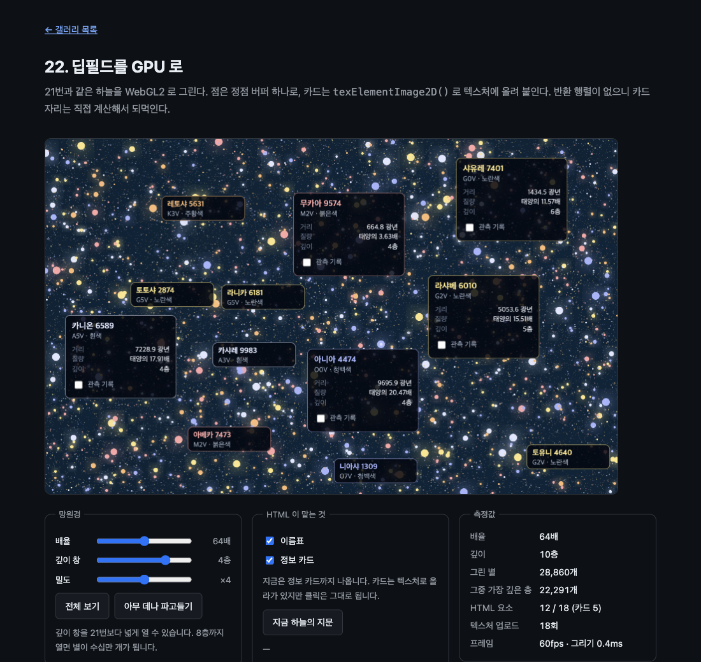

# 22. 딥필드를 GPU 로

21번과 같은 하늘을 WebGL2 로 그린다. 점은 정점 버퍼 하나로, 카드는 `texElementImage2D()` 로 텍스처에 올려 붙인다. 반환 행렬이 없으니 카드 자리는 직접 계산해서 되먹인다.



> 이 문서의 측정값은 Chrome 151.0.7922.172 (macOS, Apple GPU) 에서 2026-08-24 에 잰 것이다. 표준화 전 API 라 다음 버전에서 달라질 수 있다.

## 무엇을 배우나

- 같은 화면을 2D 경로와 WebGL 경로로 만들었을 때 무엇이 달라지는지 숫자로
- WebGL 경로에는 **반환 행렬이 없다.** 카드 자리를 직접 적어 히트 테스트를 살리는 법
- `changedElements` 로 바뀐 카드만 다시 올리기 (11번을 풀에 적용)
- 병목이 그리기가 아닐 수도 있다는 것. 그리기를 열 배 줄여도 프레임이 그만큼 오르지는 않는다

## 실행 방법

```bash
mise run serve
mise run chrome
```

브라우저에서 `galleries/22-deep-field-gpu/` 를 연다. [21번](../21-deep-field/)을 다른 탭에 함께 열어 두면 비교하기 좋다.

## 같은 하늘인가

두 예제는 같은 [`_shared/starfield.js`](../_shared/starfield.js) 를 쓴다. 같은 배율·같은 자리에서 지문이 같아야 비교가 성립한다.

```text
21번: 별 7229개 · 지문 550f346a
22번: 별 7229개 · 지문 550f346a
```

## 두 경로를 나란히

64배에서 밀도만 올려 가며 잰 값이다. 프레임은 두 페이지 모두 바깥에서 같은 방법(rAF 세기)으로 쟀다.

| 그린 별   | 21 (2D 캔버스)        | 22 (WebGL2)          |
| --------- | --------------------- | -------------------- |
| 7,229개   | 60fps · 그리기 1.3ms  | 60fps · 그리기 0.3ms |
| 28,860개  | 60fps · 그리기 6.0ms  | 60fps · 그리기 0.4ms |
| 115,506개 | 17fps · 그리기 23.1ms | 26fps · 그리기 2.1ms |

2D 는 별 수에 그대로 비례한다. 별이 열여섯 배가 되면 그리는 시간도 열여덟 배가 됐다. WebGL 은 7천 개나 11만 개나 크게 다르지 않다. 정점 버퍼에 담아 `gl.drawArrays()` 를 한 번 부르는 일이라, 별이 늘어도 늘어나는 것은 버퍼를 채우는 시간뿐이다.

**그런데 11만 개에서 프레임은 26fps 다.** 그리기를 열한 배 줄였는데도 그렇다. 남은 시간은 그리기가 아니라 **별을 만드는 JS** 가 쓰고 있다. 칸마다 별 객체를 새로 만드는 비용이다. 그리기를 아무리 줄여도 여기를 건드리지 않으면 프레임은 오르지 않는다. 어디가 병목인지 재 보지 않고 GPU 로 옮기면 이런 결과가 나온다.

## 핵심 코드

### 1. 점은 정점 버퍼 하나로

21번은 색 다섯 가지 × 밝기 세 단계로 묶어 열다섯 번 채웠다. 여기서는 별 하나가 실수 다섯 개다.

```js
const STRIDE = 5;
```

```js
starData[offset] = star.x;
starData[offset + 1] = star.y;
starData[offset + 2] = Math.min(6, Math.max(0.45, size));
starData[offset + 3] = TONES.indexOf(star.tone.color);
starData[offset + 4] = size >= 1.2 ? 1 : size >= 0.6 ? 0.55 : 0.3;
```

색은 번호만 보내고 셰이더가 팔레트에서 꺼낸다. 그리는 것은 한 번이다.

```js
gl.drawArrays(gl.POINTS, 0, starCount);
```

알맹이와 후광도 프래그먼트 셰이더가 한 번에 만든다. 21번이 두 번 그려 만든 것이다.

```glsl
  float core = 1.0 - smoothstep(starRadius - 0.5, starRadius + 0.5, distance);
  float halo = exp(-distance / max(1.0, starRadius * 1.8)) * 0.3 * step(1.5, starRadius);
```

### 2. 반환 행렬이 없다

이것이 이 예제의 요점이다. 2D 경로에서는 이렇게 썼다.

```js
const matrix = ctx.drawElementImage(slot.element, slot.spot.x, slot.spot.y);
slot.element.style.transform = matrix.toString();
```

`texElementImage2D()` 는 돌려주는 것이 없다. 텍스처에 올릴 뿐이고, 그 텍스처를 화면 어디에 붙일지는 내가 정한다. 그러니 요소에 알려 줄 행렬도 내가 적어야 한다.

```js
function sync(slot) {
  slot.element.style.transform = `matrix(1, 0, 0, 1, ${slot.spot.x}, ${slot.spot.y})`;
  slot.element.style.pointerEvents = 'auto';
}
```

카드는 평면에 그대로 붙이므로 이동만 있는 아핀이다. 그래서 손으로 적을 수 있다. 17번에서 "히트 테스트를 맞출 수 있는 것은 아핀까지" 라고 그은 경계의 뒷면이다. 곡면에 붙였다면 이 줄을 쓸 수 없다.

실제로 눌리는지 확인했다.

```text
첫 카드 transform: matrix(1, 0, 0, 1, 103, 413)
체크박스 자리: 195, 740 → INPUT
누른 뒤 checked = true
```

### 3. 바뀐 카드만 다시 올린다

11번에서 배운 것을 풀에 적용한다. `paint` 이벤트가 어떤 요소가 바뀌었는지 알려 준다.

```js
const changed = new Set(event.changedElements ?? []);
for (const slot of pool) {
  if (!slot.star) continue;
  if (slot.uploaded && changed.size > 0 && !changed.has(slot.element)) continue;
  uploadCard(slot);
}
```

요소에 다른 별을 앉히면 다시 올려야 한다. 그 표시는 내용을 고치는 자리에서 남긴다.

```js
slot.uploaded = false;
stage.requestPaint();
```

가만히 두면 업로드가 멈추고, 자리를 옮기면 그만큼만 올라간다.

```text
가만히 둔 2초 동안 늘어난 업로드: 0회
자리를 옮긴 뒤 늘어난 업로드: 12회
```

### 4. 성운도 셰이더로

21번은 `createRadialGradient()` 을 세 번 그렸다. 여기서는 프래그먼트가 세계 좌표를 되짚어 계산한다.

```glsl
  vec2 screen = vec2(gl_FragCoord.x, viewport.y - gl_FragCoord.y);
  vec2 world = (screen - viewport * 0.5) / camera.z + camera.xy;
```

## 21번과 다른 점

| 무엇이 | 21 (2D) | 22 (WebGL2) |
| --- | --- | --- |
| 컨텍스트 | `2d` | `webgl2` |
| 점 | 색·밝기별로 묶어 `arc` + `fill` 15회 | `gl.POINTS` 1회 |
| 카드 | `ctx.drawElementImage()` | `gl.texElementImage2D()` + 쿼드 |
| 카드 위치 동기화 | 반환 행렬을 되먹임 | 행렬을 손으로 적음 |
| 카드 갱신 | 매 프레임 다시 그림 | `changedElements` 로 바뀐 것만 업로드 |
| 성운 | `createRadialGradient()` | 프래그먼트 셰이더 |
| 코드 길이 | 셰이더 없음 | 셰이더 넷(하늘·별 정점/프래그먼트·카드) |

## 직접 해볼 것

- 두 예제를 나란히 열고 밀도를 ×16 으로 올려 보자. 그리기 숫자가 갈라진다
- 카드를 화면 밖으로 끌고 나갔다 돌아와 보자. 업로드 횟수가 그때만 는다
- `sync()` 의 `matrix(...)` 에서 x 를 10 더해 보자. 그림과 클릭 자리가 그만큼 어긋난다
- 별 셰이더의 `halo` 항을 0 으로 만들어 보자. 후광이 사라지고 알맹이만 남는다
- 밀도 ×16 에서 "그리기" 와 fps 를 함께 보자. 그리기가 2ms 인데 26fps 인 이유를 생각해 보자

## 막히는 지점

| 증상 | 원인 |
| --- | --- |
| 카드가 안 보인다 | 텍스처를 아직 안 올렸다. `paint` 밖에서 `texElementImage2D()` 를 부르면 막힌다 |
| 카드가 검게 나온다 | 알파를 미리 곱하지 않았다. `blendFunc(ONE, ONE_MINUS_SRC_ALPHA)` 와 짝을 맞춰라 |
| 클릭이 그림과 어긋난다 | 손으로 적은 행렬이 실제로 그린 자리와 다르다. 같은 값을 쓰는지 보라 |
| 별이 사각형으로 보인다 | `gl_PointCoord` 로 원을 오려 내지 않았다 |
| 점 크기가 안 먹는다 | `gl_PointSize` 를 정점 셰이더에서 정해야 한다. 상한도 기기마다 있다 |
| GPU 로 옮겼는데 안 빨라진다 | 병목이 그리기가 아니었다. 이 예제의 11만 개 구간이 그렇다 |

## 다음 예제

[갤러리 목록으로](../) — 21번과 나란히 놓고 보면 이 예제가 무엇을 바꿨는지 잘 보인다.
